# Instructor Setup for CodeJam

## The SAP BTP SubAccount Details

Provide details about the SAP BTP SubAccount required for the CodeJam.

1. Log in the [SAP BTP Global Account: Developer Advocates Free Tier](https://emea.cockpit.btp.cloud.sap/cockpit/#/globalaccount/275320f9-4c26-4622-8728-b6f5196075f5/accountModel&//?section=HierarchySection&view=TreeTableView).
1. Navigate to the Direcotries and SubAccounts section.There you will find a folder for CodeJams. Within that is the Subaccount [CAP CodeJam](https://emea.cockpit.btp.cloud.sap/cockpit/#/globalaccount/275320f9-4c26-4622-8728-b6f5196075f5/subaccount/13f4f274-4515-4c67-8274-cbde80a4e744/subaccountoverview).  That's where we will work.
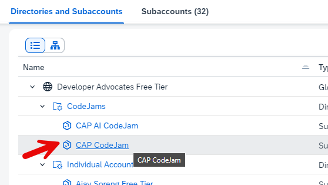

## Enable Cloud Foundry and Create a `Dev` Space

Instructions on how to Enable Cloud Foundry Environment.

1. Enable the Cloud Foundry Enviroment. 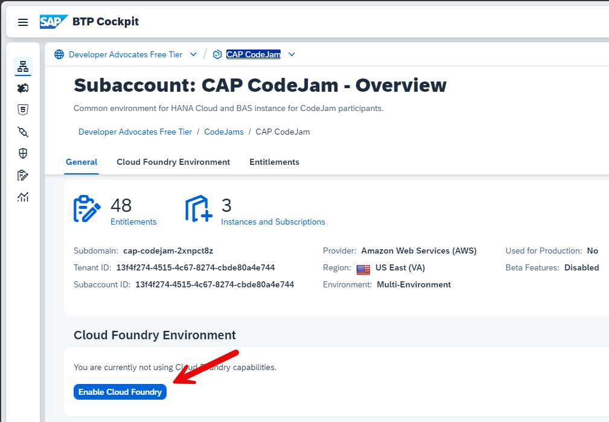
1. Use the default Enablment dialog choices.
1. Once the org is created, create a space named `dev` 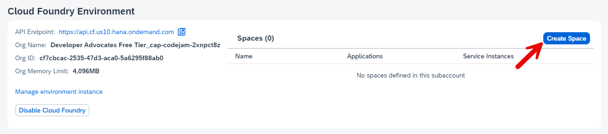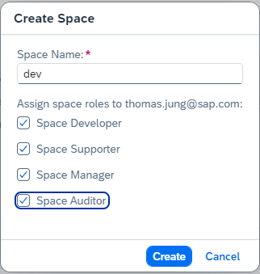
1. Add the other instructors as Space Members with all roles.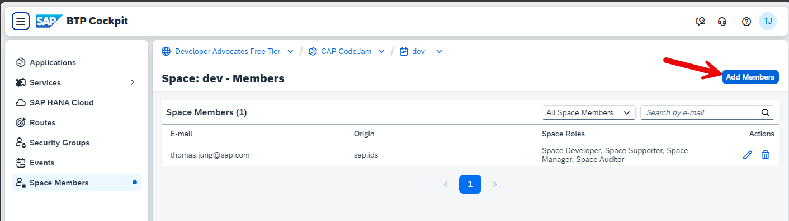

## Provisioning of SAP HANA Cloud

Instructions on how to provision SAP HANA Cloud for the event.

1. Perform all the steps in 👉 [tutorial: Deploy SAP HANA Cloud](https://developers.sap.com/tutorials/hana-cloud-deploying.html). You now have an SAP HANA database fully accessible to you with the full range of HANA Cloud capabilities.

## Adding Users

Guide on how to add users to the SAP BTP Subaccount and Cloud Foundry Environment

1. Navigate to the "Security" section in your SubAccount. `Security -> Users` 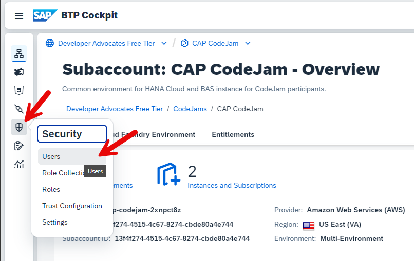
1. Create User 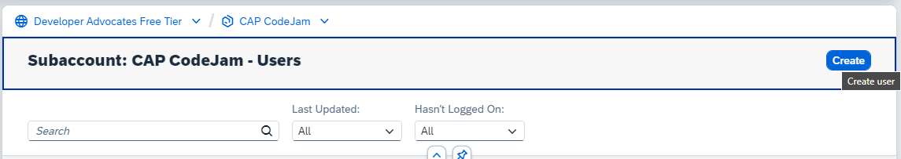
1. Enter the email addresses of the participants and use the `Default identity provider` 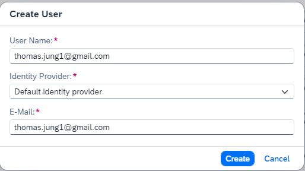
1. Assign them to the `CodeJam` Role Collection. 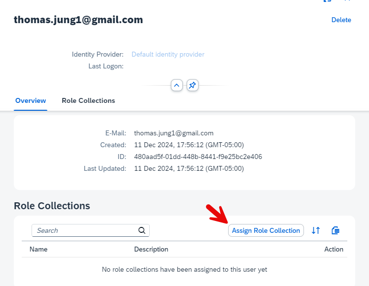 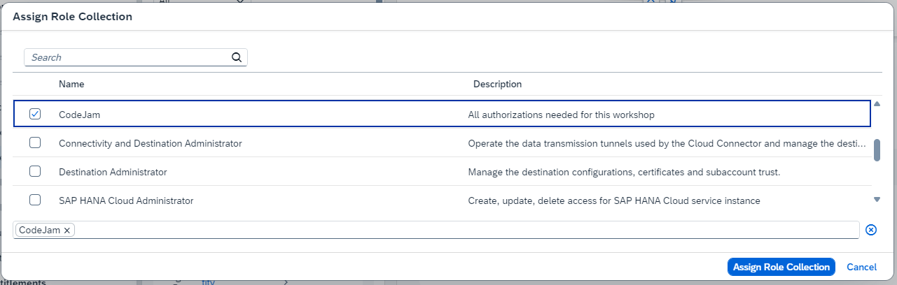
1. Assign the users to the Cloud Foundry `dev` Space 

## Clean Up After the Event

Instructions on how to clean up resources after the event.

1. Delete all the HDI container instances from the BTP Cockpit SubAccount/Instances views. 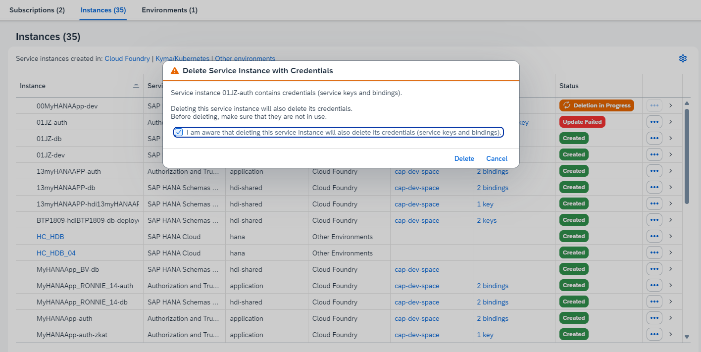

1. Disable the Cloud Foundry Enviroment. This will remove all user access at the CF level and clean up remaining resources. 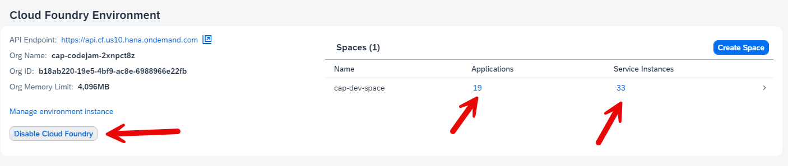

1. Delete the HANA Cloud Instance to save money.
   * From the Subscriptions click on `SAP HANA Cloud`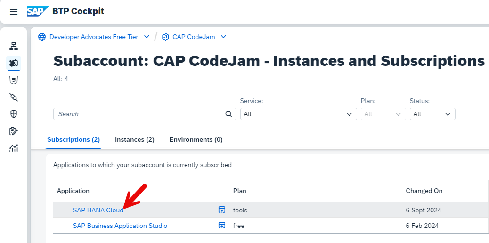
   * Then `Actions -> Delete`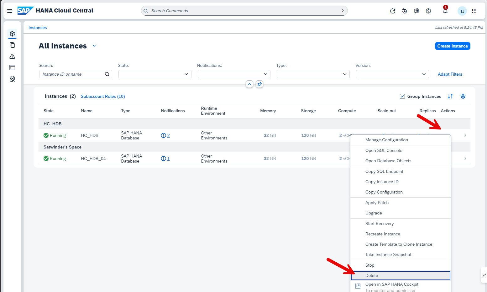

1. Remove Users
   * `Security -> Users` 
   * Manually delete all workshop users 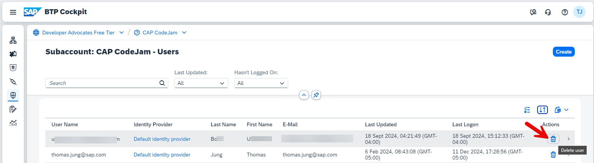

1. Remove created Role Collections
   * `Security -> Role Collections`
   * Manually delete all role collections created by the workshop users 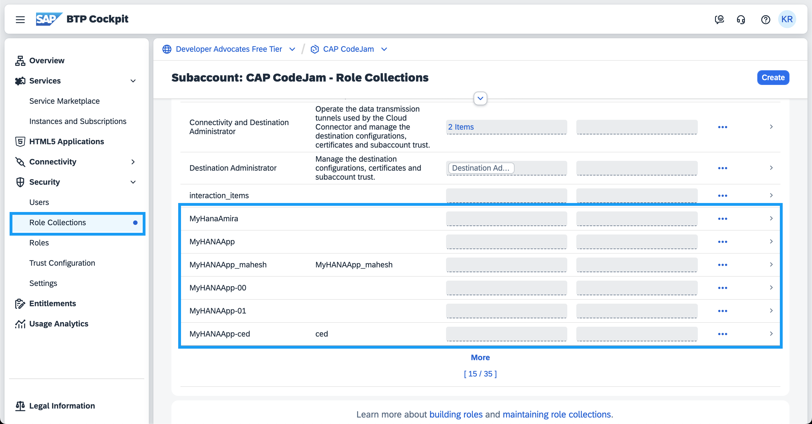
