# Instructor Setup for CodeJam

## Introduction

This document covers everything an instructor needs to prepare the SAP BTP environment for a CAP + SAP HANA Cloud CodeJam. All steps must be completed before the day of the event. You will need Global Account administrator access to the [SAP BTP Global Account: Developer Advocates Free Tier](https://emea.cockpit.btp.cloud.sap/cockpit/#/globalaccount/275320f9-4c26-4622-8728-b6f5196075f5/accountModel&//?section=HierarchySection&view=TreeTableView).

## Pre-Event Checklist

Use this checklist before each event to confirm everything is in place.

- [ ] Navigate to the SAP BTP subaccount
- [ ] Enable Cloud Foundry and create the `dev` space (including adding co-instructors as Space Members)
- [ ] Provision the SAP HANA Cloud instance
- [ ] Map the HANA Cloud instance to the CF org and space
- [ ] Set HANA Cloud allowed connections to "Allow All IP Addresses"
- [ ] Create participant users, assign the `CodeJam` Role Collection, and add to the CF `dev` space

## Pre-Event Setup

### The SAP BTP SubAccount

This is a shared, persistent subaccount used for all CAP CodeJams — do not create a new one.

1. Log in the [SAP BTP Global Account: Developer Advocates Free Tier](https://emea.cockpit.btp.cloud.sap/cockpit/#/globalaccount/275320f9-4c26-4622-8728-b6f5196075f5/accountModel&//?section=HierarchySection&view=TreeTableView).
1. Navigate to the Directories and SubAccounts section. There you will find a folder for CodeJams. Within that is the Subaccount [CAP CodeJam](https://emea.cockpit.btp.cloud.sap/cockpit/#/globalaccount/275320f9-4c26-4622-8728-b6f5196075f5/subaccount/13f4f274-4515-4c67-8274-cbde80a4e744/subaccountoverview). That's where we will work.
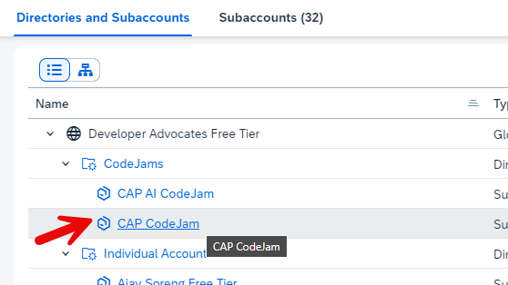

### Enable Cloud Foundry and Create a `dev` Space

CF is required because participants deploy HDI container service instances into this space.

1. Enable the Cloud Foundry Environment. 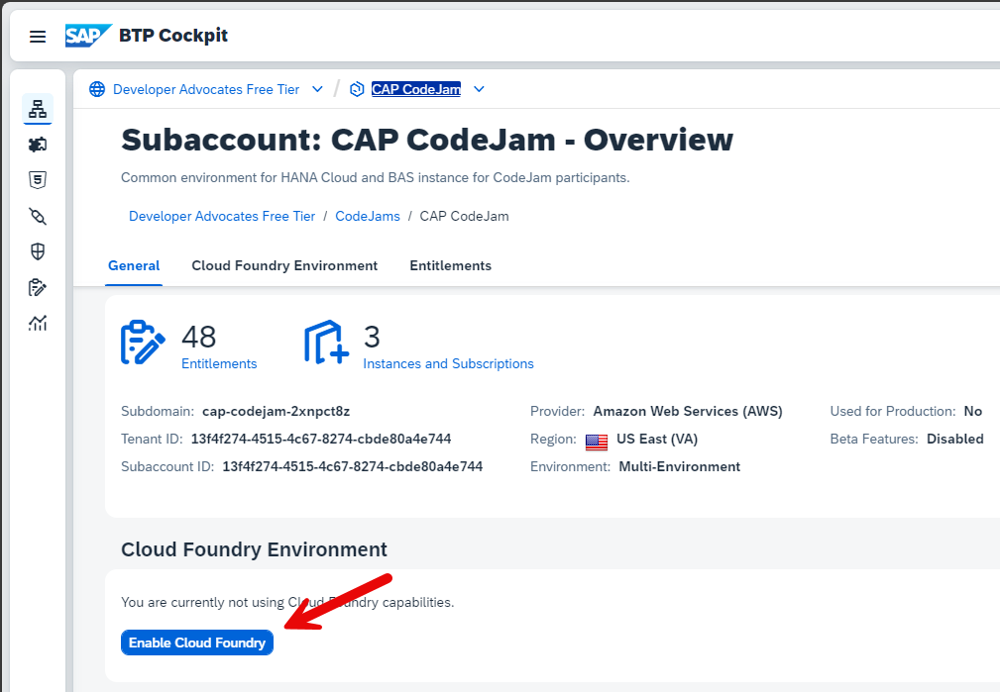
1. Use the default Enablement dialog choices.
1. Once the org is created, create a space named `dev` 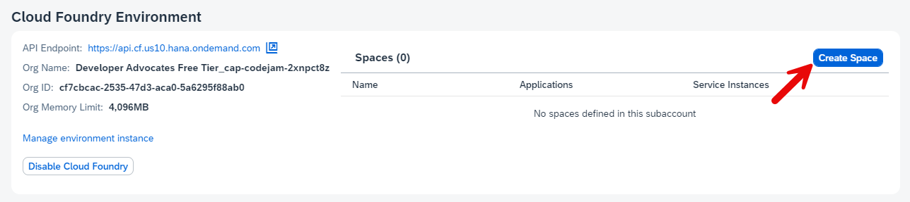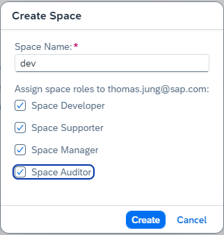
1. Add the other instructors as Space Members with all roles.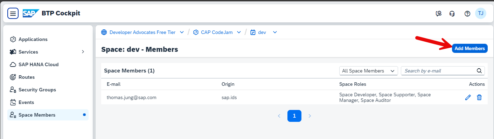

### Provisioning of SAP HANA Cloud

A single shared SAP HANA Cloud instance serves all participants during the event.

1. Perform all the steps in 👉 [tutorial: Deploy SAP HANA Cloud](https://developers.sap.com/tutorials/hana-cloud-deploying.html). You now have an SAP HANA database fully accessible to you with the full range of HANA Cloud capabilities.

> ⚠️ **Important:** The tutorial covers two steps that are easy to miss but will prevent participants from connecting to the database if skipped:
>
> 1. **CF org/space mapping** — map the HANA Cloud instance to the Cloud Foundry org and space.
> 2. **Allow All IP Addresses** — set the instance's allowed connections to "Allow All IP Addresses"; without this, dev tools such as SAP Business Application Studio cannot connect.

### Adding Users

Each participant needs both a BTP subaccount user and a Cloud Foundry space membership to complete all exercises.

> **Note:** The `CodeJam` Role Collection already exists in this subaccount (pre-built with all 41 roles covering SAP Business Application Studio, SAP HANA Cloud, Destinations, and more). Do not create a new one — simply assign the existing one to each participant.

**Action 1: Create the subaccount user and assign the Role Collection**

1. Navigate to the "Security" section in your SubAccount. `Security -> Users` 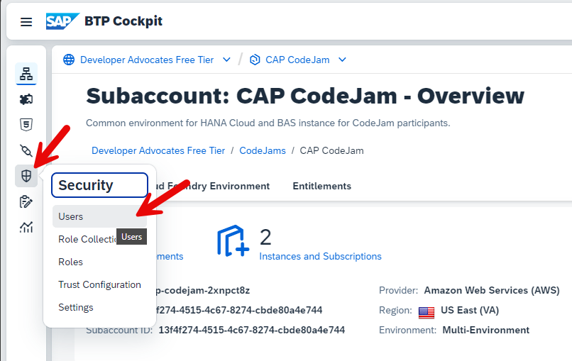
1. Create User 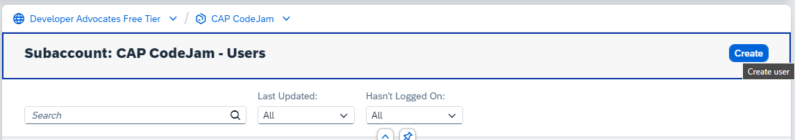
1. Enter the email addresses of the participants and use the `Default identity provider` 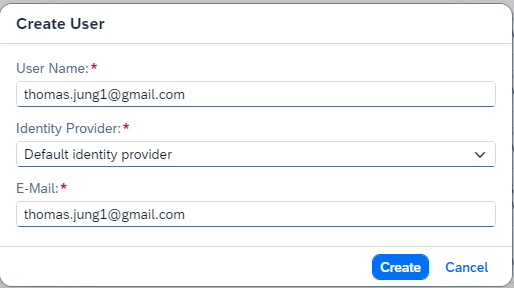
1. Assign them to the `CodeJam` Role Collection. 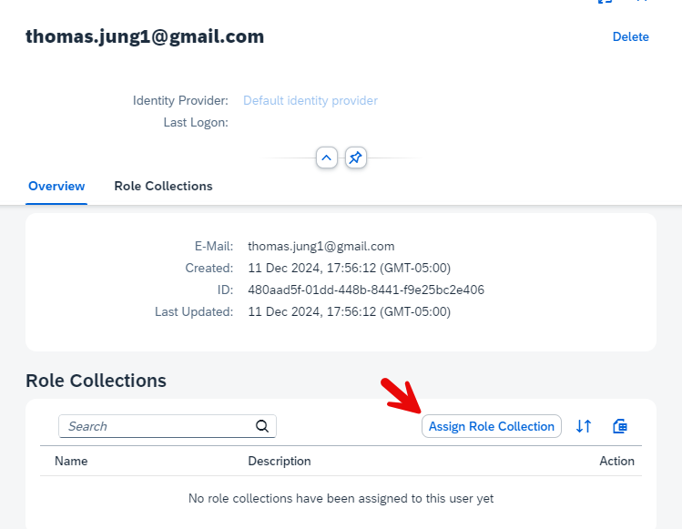 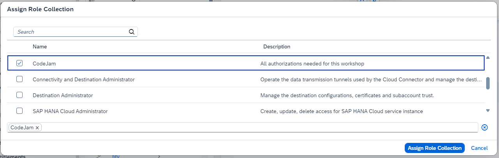

**Action 2: Add users to the Cloud Foundry space**

1. Assign the users to the Cloud Foundry `dev` Space 

## After the Event

Run these steps after every event to avoid ongoing costs and reset the subaccount for next time.

1. Delete all the HDI container instances from the BTP Cockpit SubAccount/Instances views. 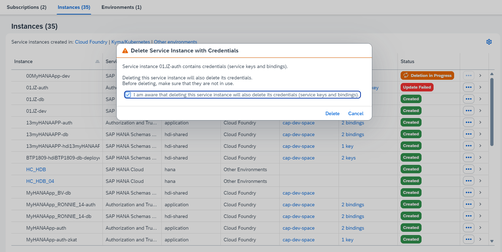

1. Disable the Cloud Foundry Environment. This will remove all user access at the CF level and clean up remaining resources. 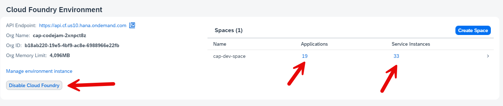

1. Delete the HANA Cloud Instance to save money.
   * From the Subscriptions click on `SAP HANA Cloud`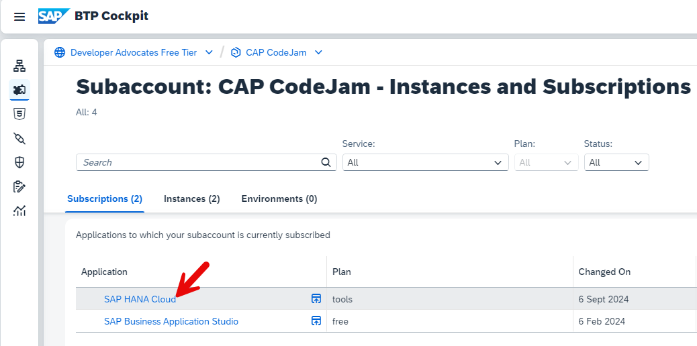
   * Then `Actions -> Delete`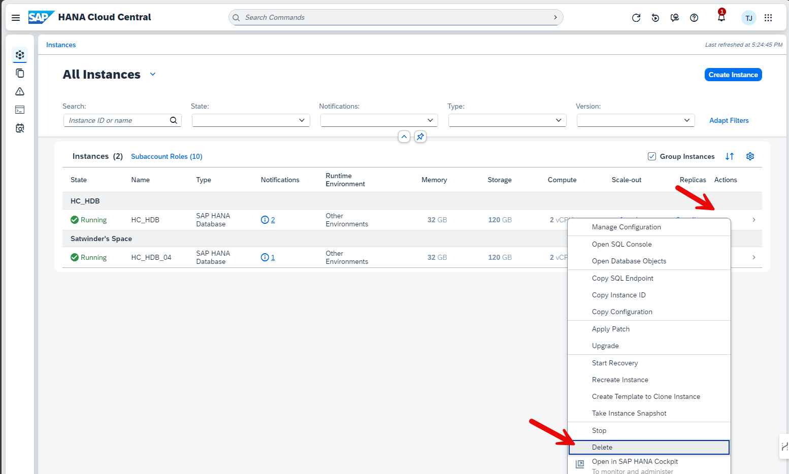

1. Remove Users
   * `Security -> Users` 
   * Manually delete all workshop users 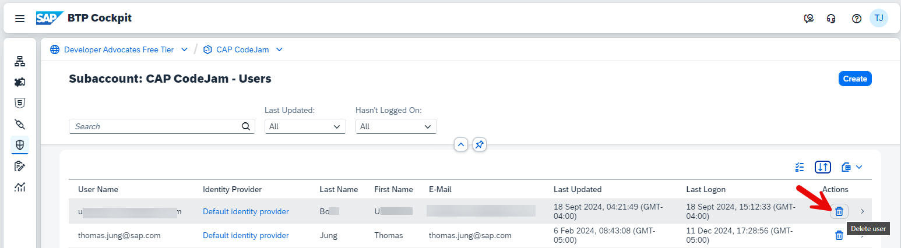

1. Remove Role Collections created by participants during the event
   * `Security -> Role Collections`
   * Delete any Role Collections that participants created during the event. Do **not** delete the `CodeJam` Role Collection — it is pre-existing and reused across events. 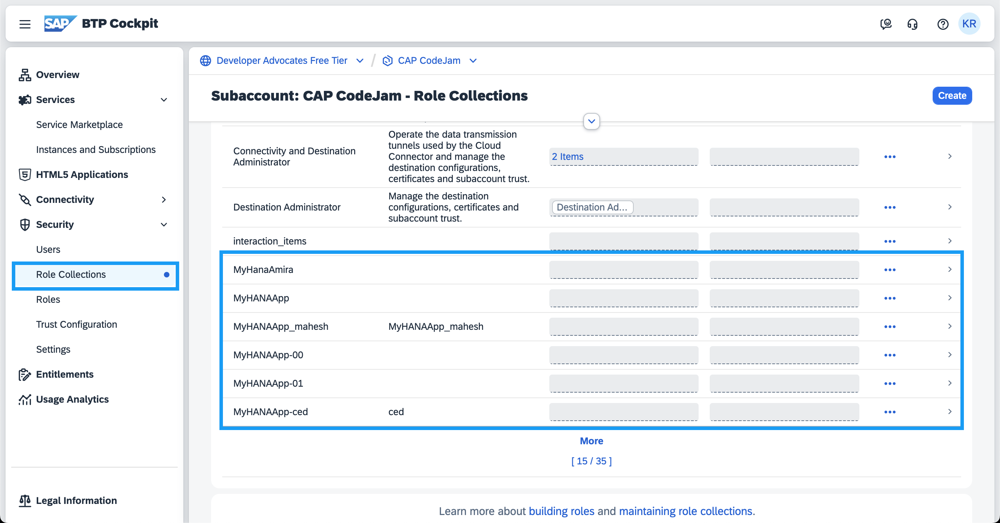
