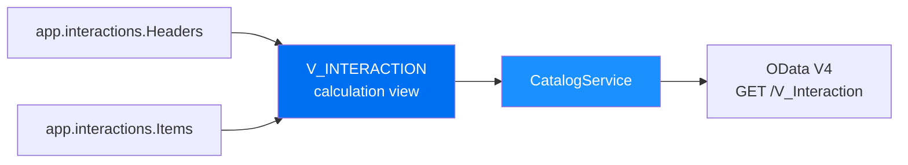

::: tip Prerequisite
Complete [Exercise 5](/exercises/ex5/) before starting this exercise.
:::

::: warning BAS required for graphical editor
The graphical calculation view editor is only available in SAP Business Application Studio. There is no supported local alternative.
:::

<!--@include: ../../../exercises/ex6/README.md-->
