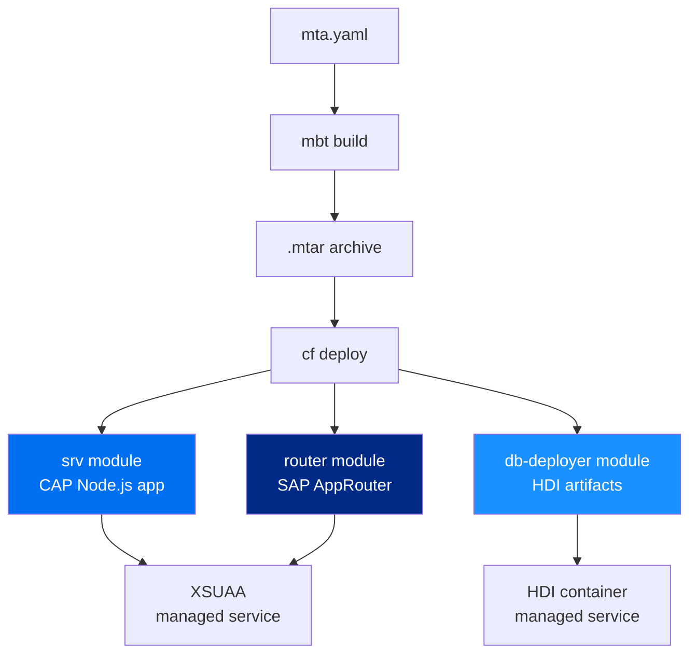

::: tip Prerequisite
Complete [Exercise 7](/exercises/ex7/) before starting this exercise.
:::

::: info MTA deployment overview
MTA (Multi-Target Application) packages all modules — CAP app, HDI deployer, and AppRouter — into a single `.mtar` archive that Cloud Foundry deploys atomically.
:::

<!--@include: ../../../exercises/ex8/README.md-->
