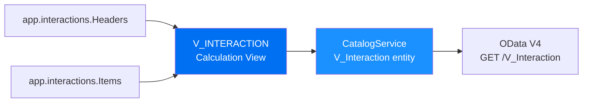
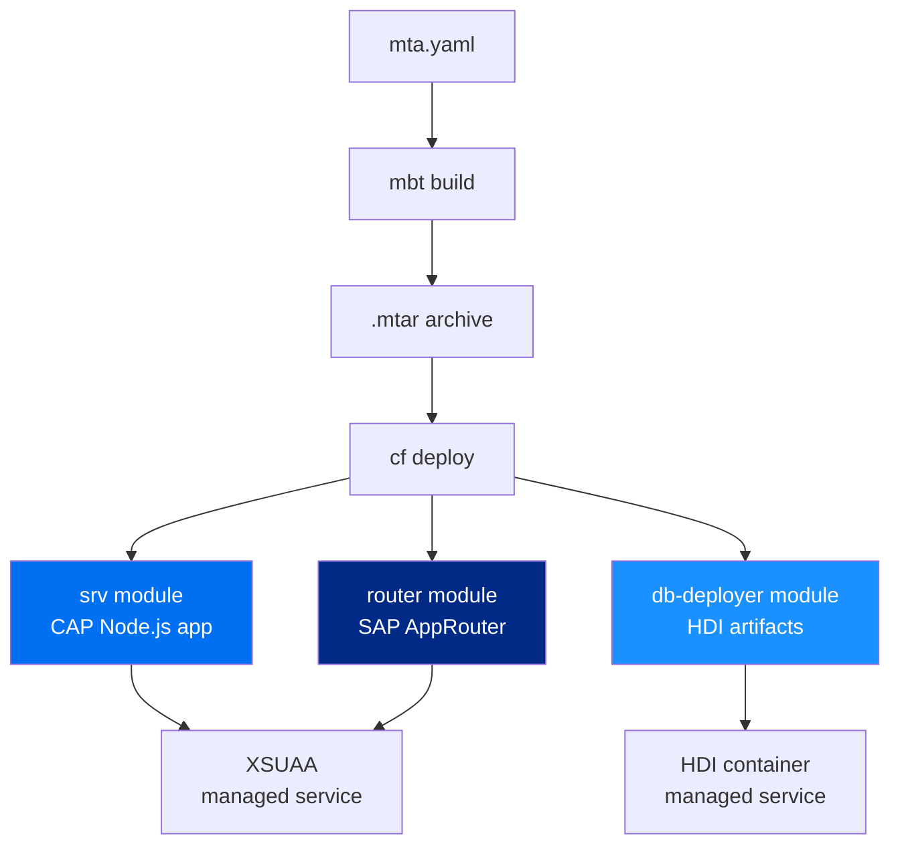

# VitePress Documentation Site Implementation Plan

> **For agentic workers:** REQUIRED SUB-SKILL: Use superpowers:subagent-driven-development (recommended) or superpowers:executing-plans to implement this plan task-by-task. Steps use checkbox (`- [ ]`) syntax for tracking.

**Goal:** Build a VitePress documentation site for the CAP + SAP HANA Cloud CodeJam repository, deployed to GitHub Pages at `https://SAP-samples.github.io/cap-hana-exercises-codejam/`.

**Architecture:** `docs/` is the VitePress source root. Wrapper pages in `docs/` include source files (exercise READMEs, root markdown) via native `<!--@include-->` — zero duplication, zero changes to source files. SAP adaptive theme (Blue 7 light / Blue 6 dark), Mermaid diagrams, @agentmarkup/vite AI optimization, i18n foundation.

**Tech Stack:** VitePress 1.6, vitepress-plugin-mermaid 2.0.17, @agentmarkup/vite ^0.4, Node.js 20 LTS, GitHub Actions

---

## File Map

| File | Action | Purpose |
| --- | --- | --- |
| `docs/package.json` | Create | VitePress toolchain + scripts |
| `docs/.vitepress/config.ts` | Create | Full site config (nav, sidebar, theme, plugins) |
| `docs/.vitepress/theme/index.ts` | Create | Extends VitePress default theme |
| `docs/.vitepress/theme/style.css` | Create | SAP color CSS variables |
| `docs/public/logo.svg` | Create | SAP logo placeholder |
| `docs/public/favicon.ico` | Create | Favicon placeholder |
| `docs/index.md` | Create | Home page — audience-driven hero |
| `docs/prerequisites/index.md` | Create | Wrapper: `prerequisites.md` |
| `docs/slides/index.md` | Create | Slides overview |
| `docs/slides/cap.md` | Create | Wrapper: `slides/CAP.md` |
| `docs/slides/hana.md` | Create | Wrapper: `slides/HANA.md` |
| `docs/exercises/index.md` | Create | Exercise learning path overview |
| `docs/exercises/ex1/index.md` | Create | Wrapper: `exercises/ex1/README.md` |
| `docs/exercises/ex2/index.md` | Create | Wrapper: `exercises/ex2/README.md` |
| `docs/exercises/ex3/index.md` | Create | Wrapper: `exercises/ex3/README.md` |
| `docs/exercises/ex4/index.md` | Create | Wrapper: `exercises/ex4/README.md` |
| `docs/exercises/ex5/index.md` | Create | Wrapper: `exercises/ex5/README.md` |
| `docs/exercises/ex6/index.md` | Create | Wrapper + Mermaid calc view diagram |
| `docs/exercises/ex7/index.md` | Create | Wrapper: `exercises/ex7/README.md` |
| `docs/exercises/ex8/index.md` | Create | Wrapper + Mermaid MTA diagram |
| `docs/solution/index.md` | Create | Wrapper: `solution/MyHANAApp/README.md` |
| `docs/instructor/index.md` | Create | Wrapper: `InstructorSetup.md` |
| `docs/ai-agents/index.md` | Create | Wrapper: `AGENT_INSTRUCTIONS.md` + MCP content |
| `docs/further-learning/index.md` | Create | Further learning hub |
| `docs/further-learning/hana-cli/index.md` | Create | Wrapper: `HANA_CLI_QUICKSTART.md` |
| `docs/further-learning/hana-cli/examples.md` | Create | Wrapper: `HANA_CLI_EXAMPLES.md` |
| `docs/further-learning/hana-cli/reference.md` | Create | Wrapper: `HANA_CLI_REFERENCE.md` |
| `docs/further-learning/hana-cli/workflows.md` | Create | Wrapper: `HANA_CLI_WORKFLOWS.md` |
| `docs/further-learning/contributing.md` | Create | Wrapper: `CONTRIBUTING.md` |
| `docs/further-learning/resources.md` | Create | Curated external links |
| `docs/i18n/README.md` | Create | Translation instructions |
| `.github/workflows/deploy-docs.yml` | Create | GitHub Actions CI/CD pipeline |
| `.gitignore` | Create | Ignore build output + generated files |
| `llms.txt` | Remove | Generated at build time — remove from source control |

**Source files — never modified:**
All files under `exercises/`, `slides/`, `solution/`, `prerequisites.md`, `InstructorSetup.md`, `AGENT_INSTRUCTIONS.md`, `CONTRIBUTING.md`, `HANA_CLI_*.md`.

---

## Task 1: VitePress Toolchain Setup

**Files:**
- Create: `docs/package.json`

- [ ] **Step 1.1: Create `docs/package.json`**

```json
{
  "name": "cap-hana-codejam-docs",
  "version": "1.0.0",
  "description": "CAP + SAP HANA Cloud CodeJam Documentation",
  "private": true,
  "type": "module",
  "scripts": {
    "docs:dev":   "vitepress dev .",
    "docs:build": "vitepress build . && echo '' > .vitepress/dist/.nojekyll",
    "docs:serve": "vitepress serve ."
  },
  "devDependencies": {
    "@agentmarkup/vite":        "^0.4.0",
    "mermaid":                  "^11.12.3",
    "vitepress":                "^1.6.0",
    "vitepress-plugin-mermaid": "2.0.17",
    "vue":                      "^3.5.29"
  }
}
```

> `vitepress-plugin-mermaid` is pinned to `2.0.17` (no `^`) — do NOT change this; it has a history of breaking on minor VitePress bumps.

- [ ] **Step 1.2: Install dependencies**

Run from `docs/`:
```bash
cd docs && npm install
```

Expected: `node_modules/` created, `package-lock.json` generated, no errors.

- [ ] **Step 1.3: Verify VitePress is installed**

```bash
cd docs && npx vitepress --version
```

Expected: prints `vitepress/1.6.x` (or similar 1.6+ version).

- [ ] **Step 1.4: Commit**

```bash
git add docs/package.json docs/package-lock.json
git commit -m "feat: add VitePress toolchain to docs/"
```

---

## Task 2: SAP Adaptive Theme

**Files:**
- Create: `docs/.vitepress/theme/style.css`
- Create: `docs/.vitepress/theme/index.ts`

- [ ] **Step 2.1: Create `docs/.vitepress/theme/style.css`**

```css
/* ── Light mode: SAP Blue 7 ─────────────────────────────── */
:root {
  --vp-c-brand-1: #0070F2;          /* SAP Blue 7  — primary */
  --vp-c-brand-2: #1B90FF;          /* SAP Blue 6  — hover   */
  --vp-c-brand-3: #D1EFFF;          /* SAP Blue 2  — tint bg */
  --vp-c-brand-soft: rgba(0, 112, 242, 0.14);
}

/* ── Dark mode: SAP Blue 6 on Blue 11 ───────────────────── */
.dark {
  --vp-c-brand-1: #1B90FF;          /* SAP Blue 6  — primary */
  --vp-c-brand-2: #89D1FF;          /* SAP Blue 4  — hover   */
  --vp-c-brand-3: #002A86;          /* SAP Blue 10 — tint bg */
  --vp-c-brand-soft: rgba(27, 144, 255, 0.16);
  --vp-c-bg: #00144A;               /* SAP Blue 11 — page bg */
  --vp-c-bg-soft: #0d1f3c;          /* near Blue 11 — softer  */
  --vp-c-bg-mute: #142340;
}
```

- [ ] **Step 2.2: Create `docs/.vitepress/theme/index.ts`**

```ts
import { h } from 'vue'
import Theme from 'vitepress/theme'
import './style.css'

export default {
  extends: Theme,
  Layout: () => h(Theme.Layout, null, {}),
}
```

- [ ] **Step 2.3: Commit**

```bash
git add docs/.vitepress/theme/
git commit -m "feat: add SAP adaptive theme (Blue 7 light / Blue 6 dark)"
```

---

## Task 3: Static Assets

**Files:**
- Create: `docs/public/logo.svg`
- Create: `docs/public/favicon.ico` (placeholder)

> **Note:** Obtain the official SAP logo SVG from the [SAP brand portal](https://www.sap.com/corporate/en/brand/brand-guidelines.html). Until then, use the placeholder SVG below.

- [ ] **Step 3.1: Create `docs/public/logo.svg` (placeholder)**

```xml
<svg xmlns="http://www.w3.org/2000/svg" viewBox="0 0 100 40" width="100" height="40">
  <rect width="100" height="40" fill="#0070F2" rx="4"/>
  <text x="50" y="26" font-family="sans-serif" font-size="18" font-weight="bold"
        fill="white" text-anchor="middle">SAP</text>
</svg>
```

- [ ] **Step 3.2: Create a 1×1 pixel favicon placeholder**

Run from the repo root:
```bash
# Create a minimal valid ICO file (1x1 transparent pixel)
printf '\x00\x00\x01\x00\x01\x00\x01\x01\x00\x00\x01\x00\x18\x00\x28\x00\x00\x00\x16\x00\x00\x00\x28\x00\x00\x00\x01\x00\x00\x00\x02\x00\x00\x00\x01\x00\x18\x00\x00\x00\x00\x00\x04\x00\x00\x00\x00\x00\x00\x00\x00\x00\x00\x00\x00\x00\x00\x00\x00\x00\x00\x00\x00\x00\x00\x00\xff\x00\x00\x00\x00' > docs/public/favicon.ico
```

> Replace both files with official SAP brand assets before publishing. The placeholder prevents build errors from missing references in `config.ts`.

- [ ] **Step 3.3: Commit**

```bash
git add docs/public/
git commit -m "feat: add static asset placeholders (logo, favicon)"
```

---

## Task 4: VitePress Config

**Files:**
- Create: `docs/.vitepress/config.ts`

- [ ] **Step 4.1: Create `docs/.vitepress/config.ts`**

```ts
import { defineConfig } from 'vitepress'
import { withMermaid } from 'vitepress-plugin-mermaid'
import { agentmarkup } from '@agentmarkup/vite'

const BASE = '/cap-hana-exercises-codejam/'
const SITE_URL = 'https://SAP-samples.github.io/cap-hana-exercises-codejam'

export default withMermaid(
  defineConfig({
    base: BASE,
    // No srcDir override — VitePress uses docs/ as source root.
    // All wrapper pages in docs/ produce clean URLs:
    //   docs/exercises/ex1/index.md  →  /exercises/ex1/
    //   docs/prerequisites/index.md  →  /prerequisites/
    // Source files outside docs/ are never served directly.
    srcExclude: [
      'superpowers/**',            // spec/plan authoring artifacts — not public pages
    ],

    title: 'CAP + SAP HANA Cloud CodeJam',
    description: 'Hands-on workshop: build full-stack apps with SAP CAP and SAP HANA Cloud',
    lang: 'en-US',
    cleanUrls: true,
    lastUpdated: true,
    ignoreDeadLinks: true,
    appearance: 'auto',

    markdown: {
      languageAlias: { cds: 'typescript' },
    },

    // locales is a top-level defineConfig key — NOT inside themeConfig
    locales: {
      root: { label: 'English', lang: 'en-US' },
      // Uncomment to activate a language and create docs/<code>/ directory:
      // de: { label: 'Deutsch',    lang: 'de', link: '/de/' },
      // ja: { label: '日本語',     lang: 'ja', link: '/ja/' },
      // es: { label: 'Español',    lang: 'es', link: '/es/' },
      // pt: { label: 'Português',  lang: 'pt', link: '/pt/' },
      // fr: { label: 'Français',   lang: 'fr', link: '/fr/' },
      // zh: { label: '中文',       lang: 'zh', link: '/zh/' },
    },

    head: [
      ['link', { rel: 'icon', href: `${BASE}favicon.ico` }],
      ['meta', { name: 'theme-color', content: '#0070F2' }],
      ['meta', { name: 'og:type', content: 'website' }],
      ['meta', { name: 'og:site_name', content: 'CAP + SAP HANA Cloud CodeJam' }],
    ],

    themeConfig: {
      logo: '/logo.svg',
      siteTitle: 'CAP + HANA CodeJam',
      outline: { level: [2, 3], label: 'On this page' },

      nav: [
        { text: 'Home', link: '/' },
        { text: 'Prerequisites', link: '/prerequisites/' },
        {
          text: 'Slides',
          items: [
            { text: 'Overview',            link: '/slides/' },
            { text: 'CAP Overview',        link: '/slides/cap' },
            { text: 'HANA Cloud Overview', link: '/slides/hana' },
          ],
        },
        {
          text: 'Exercises',
          items: [
            { text: 'Overview',                    link: '/exercises/' },
            { text: 'Ex 1 — HANA Cloud Setup',    link: '/exercises/ex1/' },
            { text: 'Ex 2 — CAP Project',         link: '/exercises/ex2/' },
            { text: 'Ex 3 — Database Artifacts',  link: '/exercises/ex3/' },
            { text: 'Ex 4 — Fiori UI',            link: '/exercises/ex4/' },
            { text: 'Ex 5 — Authentication',      link: '/exercises/ex5/' },
            { text: 'Ex 6 — Calculation View',    link: '/exercises/ex6/' },
            { text: 'Ex 7 — Stored Procedure',    link: '/exercises/ex7/' },
            { text: 'Ex 8 — MTA Deployment',      link: '/exercises/ex8/' },
          ],
        },
        { text: 'Solution',   link: '/solution/' },
        { text: 'Instructor', link: '/instructor/' },
        { text: 'AI/Agents',  link: '/ai-agents/' },
        {
          text: 'Further Learning',
          items: [
            { text: 'Overview',     link: '/further-learning/' },
            { text: 'HANA CLI',     link: '/further-learning/hana-cli/' },
            { text: 'Resources',    link: '/further-learning/resources' },
            { text: 'Contributing', link: '/further-learning/contributing' },
          ],
        },
      ],

      sidebar: {
        '/slides/': [
          {
            text: 'Slides',
            items: [
              { text: 'Overview',            link: '/slides/' },
              { text: 'CAP Overview',        link: '/slides/cap' },
              { text: 'HANA Cloud Overview', link: '/slides/hana' },
            ],
          },
        ],
        '/exercises/': [
          {
            text: 'Exercises',
            items: [
              { text: 'Learning Path Overview',    link: '/exercises/' },
              { text: 'Ex 1 — HANA Cloud Setup',   link: '/exercises/ex1/' },
              { text: 'Ex 2 — CAP Project',        link: '/exercises/ex2/' },
              { text: 'Ex 3 — Database Artifacts', link: '/exercises/ex3/' },
              { text: 'Ex 4 — Fiori UI',           link: '/exercises/ex4/' },
              { text: 'Ex 5 — Authentication',     link: '/exercises/ex5/' },
              { text: 'Ex 6 — Calculation View',   link: '/exercises/ex6/' },
              { text: 'Ex 7 — Stored Procedure',   link: '/exercises/ex7/' },
              { text: 'Ex 8 — MTA Deployment',     link: '/exercises/ex8/' },
            ],
          },
        ],
        '/further-learning/': [
          {
            text: 'Further Learning',
            items: [{ text: 'Overview', link: '/further-learning/' }],
          },
          {
            text: 'HANA CLI',
            collapsed: false,
            items: [
              { text: 'Quick Start', link: '/further-learning/hana-cli/' },
              { text: 'Examples',    link: '/further-learning/hana-cli/examples' },
              { text: 'Reference',   link: '/further-learning/hana-cli/reference' },
              { text: 'Workflows',   link: '/further-learning/hana-cli/workflows' },
            ],
          },
          {
            text: 'Community',
            items: [
              { text: 'Contributing', link: '/further-learning/contributing' },
              { text: 'Resources',    link: '/further-learning/resources' },
            ],
          },
        ],
      },

      search: { provider: 'local' },

      socialLinks: [
        { icon: 'github', link: 'https://github.com/SAP-samples/cap-hana-exercises-codejam' },
      ],

      footer: {
        message: 'Released under the <a href="https://github.com/SAP-samples/cap-hana-exercises-codejam/blob/main/LICENSE">Apache License 2.0</a>',
        copyright: 'Copyright © 2026 SAP SE | <a href="https://www.sap.com/about/legal/impressum.html">Legal Disclosure</a>',
      },

      // :path resolves relative to srcDir (docs/).
      // docs/exercises/ex1/index.md → :path = 'exercises/ex1/index.md'
      // The 'docs/' prefix completes the correct GitHub file path.
      editLink: {
        pattern: 'https://github.com/SAP-samples/cap-hana-exercises-codejam/edit/main/docs/:path',
        text: 'Edit this page on GitHub',
      },

      lastUpdated: {
        text: 'Last updated',
        formatOptions: { dateStyle: 'short', timeStyle: 'short' },
      },
    },

    vite: {
      build: { chunkSizeWarningLimit: 2000 },
      plugins: [
        // agentmarkup goes inside vite.plugins — NOT as a standalone call
        agentmarkup({
          site: SITE_URL,
          name: 'CAP + SAP HANA Cloud CodeJam',
          globalSchemas: [
            { preset: 'webSite', name: 'CAP + SAP HANA Cloud CodeJam', url: SITE_URL },
            { preset: 'organization', name: 'SAP', url: 'https://www.sap.com' },
          ],
          llmsTxt: {
            title: 'CAP + SAP HANA Cloud CodeJam',
            description: 'Hands-on workshop for building full-stack applications with SAP Cloud Application Programming Model (CAP) and SAP HANA Cloud. Eight exercises from environment setup through MTA deployment.',
            sections: [
              {
                title: 'Prerequisites',
                entries: [
                  { title: 'Prerequisites', url: `${SITE_URL}/prerequisites/`,
                    description: 'Environment setup for BAS, local, Dev Container, and Codespaces' },
                ],
              },
              {
                title: 'Exercises',
                entries: [
                  { title: 'Exercise 1 — HANA Cloud Setup',   url: `${SITE_URL}/exercises/ex1/`, description: 'Provision SAP HANA Cloud and configure development environment' },
                  { title: 'Exercise 2 — CAP Project',        url: `${SITE_URL}/exercises/ex2/`, description: 'Scaffold a CAP Node.js project with HANA Cloud target' },
                  { title: 'Exercise 3 — Database Artifacts', url: `${SITE_URL}/exercises/ex3/`, description: 'Define CDS entities and deploy via HDI' },
                  { title: 'Exercise 4 — Fiori UI',           url: `${SITE_URL}/exercises/ex4/`, description: 'Generate SAP Fiori Elements List Report UI' },
                  { title: 'Exercise 5 — Authentication',     url: `${SITE_URL}/exercises/ex5/`, description: 'Add XSUAA OAuth2 and role-based access control' },
                  { title: 'Exercise 6 — Calculation View',   url: `${SITE_URL}/exercises/ex6/`, description: 'Create HANA Calculation View and expose via CAP' },
                  { title: 'Exercise 7 — Stored Procedure',   url: `${SITE_URL}/exercises/ex7/`, description: 'Create HANA stored procedure as CAP service function' },
                  { title: 'Exercise 8 — MTA Deployment',     url: `${SITE_URL}/exercises/ex8/`, description: 'Deploy complete application as Multi-Target Application to CF' },
                ],
              },
              {
                title: 'Reference',
                entries: [
                  { title: 'Solution',   url: `${SITE_URL}/solution/`,   description: 'Complete reference implementation walkthrough' },
                  { title: 'Instructor', url: `${SITE_URL}/instructor/`, description: 'Event setup and teardown procedures' },
                  { title: 'AI/Agents',  url: `${SITE_URL}/ai-agents/`,  description: 'MCP server setup, agent instructions, AI-assisted development' },
                  { title: 'HANA CLI',   url: `${SITE_URL}/further-learning/hana-cli/`, description: 'SAP HANA Developer CLI reference' },
                ],
              },
            ],
          },
          llmsFullTxt: { enabled: true },
        }),
      ],
    },
  }),

  // Mermaid options are the SECOND ARGUMENT to withMermaid — NOT inside defineConfig
  {
    mermaid: {
      theme: 'default',
      startOnLoad: true,
      securityLevel: 'antiscript',
      flowchart: {
        useMaxWidth: true,
        htmlLabels: true,
        nodeSpacing: 50,
        rankSpacing: 60,
        curve: 'basis',
      },
      logLevel: 'error',
    },
  }
)
```

- [ ] **Step 4.2: Verify the config file has no TypeScript errors**

Run from `docs/`:
```bash
cd docs && npx tsc --noEmit --skipLibCheck --moduleResolution bundler --module esnext .vitepress/config.ts 2>&1 | head -20
```

Expected: no output (no errors). Minor warnings about missing types are acceptable.

- [ ] **Step 4.3: Commit**

```bash
git add docs/.vitepress/config.ts
git commit -m "feat: add full VitePress config with SAP nav, sidebar, Mermaid, agentmarkup"
```

---

## Task 5: Home Page

**Files:**
- Create: `docs/index.md`

VitePress `layout: home` renders a hero + features grid. `docs/index.md` maps to URL `/` (the site root).

- [ ] **Step 5.1: Create `docs/index.md`**

```markdown
---
layout: home

hero:
  name: "CAP + HANA Cloud"
  text: "CodeJam"
  tagline: Build full-stack SAP applications from zero to deployed in 8 hands-on exercises
  image:
    src: /logo.svg
    alt: SAP
  actions:
    - theme: brand
      text: Start Learning →
      link: /exercises/
    - theme: alt
      text: View Prerequisites
      link: /prerequisites/

features:
  - icon: 🎓
    title: Attending an event?
    details: Follow along with your instructor. Start with the Prerequisites to get your environment ready before the session.
    link: /prerequisites/
    linkText: Go to Prerequisites
  - icon: 📖
    title: Self-studying?
    details: Work through all 8 exercises at your own pace — from HANA Cloud setup through MTA deployment.
    link: /exercises/ex1/
    linkText: Start Exercise 1
  - icon: 🧑‍🏫
    title: Running an event?
    details: Set up participant accounts, provision HANA Cloud, and manage SAP BTP resources for your group.
    link: /instructor/
    linkText: Instructor Setup
  - icon: 🤖
    title: Using AI assistance?
    details: Connect MCP servers, configure AI agents, and use Claude Code or GitHub Copilot with this repository.
    link: /ai-agents/
    linkText: AI & Agents Guide
---

<div style="text-align:center;padding:2rem 0 1rem">

**CAP** · **SAP HANA Cloud** · **Fiori Elements** · **XSUAA** · **HDI** · **MTA**

</div>
```

- [ ] **Step 5.2: Start the dev server and check the home page**

```bash
cd docs && npm run docs:dev
```

Open `http://localhost:5173/cap-hana-exercises-codejam/` in a browser.

Expected: Hero section visible with "CAP + HANA Cloud CodeJam" heading, 4 feature cards, SAP Blue color scheme.

- [ ] **Step 5.3: Commit**

```bash
git add docs/index.md
git commit -m "feat: add audience-driven home page with VitePress hero layout"
```

---

## Task 6: Prerequisites Wrapper

**Files:**
- Create: `docs/prerequisites/index.md`

- [ ] **Step 6.1: Create `docs/prerequisites/index.md`**

```markdown
---
title: Prerequisites
description: Set up your development environment before the CodeJam exercises
next:
  text: 'Slides — Architecture Overview'
  link: '/slides/'
---

::: info What you'll need
Choose your preferred development environment below. SAP Business Application Studio (BAS) requires only a web browser. Local setup requires Node.js 20+ and additional tools.
:::

<!--@include: ../../prerequisites.md-->
```

- [ ] **Step 6.2: Verify the include resolves**

With dev server running, navigate to `http://localhost:5173/cap-hana-exercises-codejam/prerequisites/`.

Expected: Full prerequisites content visible (multiple sections covering BAS, local, Dev Container, Codespaces). No "include file not found" error in the terminal.

- [ ] **Step 6.3: Commit**

```bash
git add docs/prerequisites/
git commit -m "feat: add prerequisites wrapper page"
```

---

## Task 7: Slides Wrappers

**Files:**
- Create: `docs/slides/index.md`
- Create: `docs/slides/cap.md`
- Create: `docs/slides/hana.md`

- [ ] **Step 7.1: Create `docs/slides/index.md`**

```markdown
---
title: Architecture Slides
description: Presentation slides introducing SAP CAP and SAP HANA Cloud concepts
next:
  text: 'Exercises'
  link: '/exercises/'
---

These slides provide the conceptual foundation for the CodeJam exercises. Review them before starting or use them as a reference during the workshop.

| Deck | Topics |
| --- | --- |
| [CAP Overview](/slides/cap) | What is CAP, project structure, CDS, service layer, deployment |
| [HANA Cloud Overview](/slides/hana) | HANA Cloud architecture, HDI, column store, calculation views |
```

- [ ] **Step 7.2: Create `docs/slides/cap.md`**

```markdown
---
title: CAP Overview — Architecture Slides
description: SAP Cloud Application Programming Model concepts and architecture
prev:
  text: 'Slides Overview'
  link: '/slides/'
next:
  text: 'HANA Cloud Overview'
  link: '/slides/hana'
---

<!--@include: ../../slides/CAP.md-->
```

- [ ] **Step 7.3: Create `docs/slides/hana.md`**

```markdown
---
title: HANA Cloud Overview — Architecture Slides
description: SAP HANA Cloud architecture, HDI containers, and database concepts
prev:
  text: 'CAP Overview'
  link: '/slides/cap'
next:
  text: 'Exercises'
  link: '/exercises/'
---

<!--@include: ../../slides/HANA.md-->
```

- [ ] **Step 7.4: Verify slides render with Mermaid diagrams**

Navigate to `http://localhost:5173/cap-hana-exercises-codejam/slides/cap`.

Expected: Slide content visible. Any Mermaid diagrams in the source files render as diagrams (not raw code blocks).

- [ ] **Step 7.5: Commit**

```bash
git add docs/slides/
git commit -m "feat: add slides section with CAP and HANA Cloud wrapper pages"
```

---

## Task 8: Exercises Overview + Ex1–Ex4 Wrappers

**Files:**
- Create: `docs/exercises/index.md`
- Create: `docs/exercises/ex1/index.md` through `docs/exercises/ex4/index.md`

- [ ] **Step 8.1: Create `docs/exercises/index.md`**

```markdown
---
title: Exercises
description: Eight hands-on exercises building a full-stack CAP + HANA Cloud application
next:
  text: 'Exercise 1 — Set Up SAP HANA Cloud'
  link: '/exercises/ex1/'
---

## Learning Path

Work through the exercises in order — each one builds on the previous.

| Exercise | Topic | What you build |
| --- | --- | --- |
| [Ex 1](/exercises/ex1/) | HANA Cloud Setup | Provision HANA Cloud, configure BAS |
| [Ex 2](/exercises/ex2/) | CAP Project | Scaffold project, connect to HANA |
| [Ex 3](/exercises/ex3/) | Database Artifacts | CDS entities, HDI deployment |
| [Ex 4](/exercises/ex4/) | Fiori UI | List Report app with OData V4 |
| [Ex 5](/exercises/ex5/) | Authentication | XSUAA, roles, authorization |
| [Ex 6](/exercises/ex6/) | Calculation View | HANA-native analytics, CAP proxy |
| [Ex 7](/exercises/ex7/) | Stored Procedure | SQLScript procedure as CAP function |
| [Ex 8](/exercises/ex8/) | MTA Deployment | Deploy to Cloud Foundry as MTA |

::: tip Time estimate
Each exercise takes approximately 30–45 minutes. Allow extra time for exercises 5 and 8 (authentication and deployment are the most complex).
:::
```

- [ ] **Step 8.2: Create `docs/exercises/ex1/index.md`**

```markdown
---
title: 'Exercise 1 — Set Up SAP HANA Cloud'
description: Provision SAP HANA Cloud and configure your development environment in SAP BAS
prev:
  text: 'Exercises Overview'
  link: '/exercises/'
next:
  text: 'Exercise 2 — Create a CAP Project'
  link: '/exercises/ex2/'
---

::: tip Before you start
Complete the [Prerequisites](/prerequisites/) to ensure your SAP BTP account and development environment are ready.
:::

<!--@include: ../../../exercises/ex1/README.md-->
```

- [ ] **Step 8.3: Create `docs/exercises/ex2/index.md`**

```markdown
---
title: 'Exercise 2 — Create a CAP Project'
description: Scaffold a CAP Node.js project targeting SAP HANA Cloud
prev:
  text: 'Exercise 1 — Set Up SAP HANA Cloud'
  link: '/exercises/ex1/'
next:
  text: 'Exercise 3 — Create Database Artifacts'
  link: '/exercises/ex3/'
---

::: tip Prerequisite
Complete [Exercise 1](/exercises/ex1/) before starting this exercise.
:::

<!--@include: ../../../exercises/ex2/README.md-->
```

- [ ] **Step 8.4: Create `docs/exercises/ex3/index.md`**

```markdown
---
title: 'Exercise 3 — Create Database Artifacts'
description: Define CDS entities and deploy HDI artifacts to SAP HANA Cloud
prev:
  text: 'Exercise 2 — Create a CAP Project'
  link: '/exercises/ex2/'
next:
  text: 'Exercise 4 — Create a Fiori UI'
  link: '/exercises/ex4/'
---

::: tip Prerequisite
Complete [Exercise 2](/exercises/ex2/) before starting this exercise.
:::

::: warning Known issue
HDI deployment can take 2–3 minutes on first run. If it times out, re-run `cds build --production` and redeploy.
:::

<!--@include: ../../../exercises/ex3/README.md-->
```

- [ ] **Step 8.5: Create `docs/exercises/ex4/index.md`**

```markdown
---
title: 'Exercise 4 — Create a Fiori UI'
description: Generate a SAP Fiori Elements List Report UI with OData V4
prev:
  text: 'Exercise 3 — Create Database Artifacts'
  link: '/exercises/ex3/'
next:
  text: 'Exercise 5 — Add Authentication'
  link: '/exercises/ex5/'
---

::: tip Prerequisite
Complete [Exercise 3](/exercises/ex3/) before starting this exercise. Your HDI container must be deployed.
:::

<!--@include: ../../../exercises/ex4/README.md-->
```

- [ ] **Step 8.6: Verify Ex1–Ex4 render correctly**

Navigate to each page in the dev server:
- `http://localhost:5173/cap-hana-exercises-codejam/exercises/`
- `http://localhost:5173/cap-hana-exercises-codejam/exercises/ex1/`
- `http://localhost:5173/cap-hana-exercises-codejam/exercises/ex4/`

Expected: Each page shows the callout tip followed by the full exercise README content. Sidebar shows all 8 exercises listed.

- [ ] **Step 8.7: Commit**

```bash
git add docs/exercises/
git commit -m "feat: add exercises overview and Ex1-Ex4 wrapper pages"
```

---

## Task 9: Exercise Wrappers Ex5–Ex8 (with Mermaid diagrams)

**Files:**
- Create: `docs/exercises/ex5/index.md` through `docs/exercises/ex8/index.md`

Ex6 and Ex8 include additional Mermaid architecture diagrams not present in the source files.

- [ ] **Step 9.1: Create `docs/exercises/ex5/index.md`**

```markdown
---
title: 'Exercise 5 — Add User Authentication'
description: Add XSUAA OAuth2 authentication and role-based access control
prev:
  text: 'Exercise 4 — Create a Fiori UI'
  link: '/exercises/ex4/'
next:
  text: 'Exercise 6 — Create a Calculation View'
  link: '/exercises/ex6/'
---

::: tip Prerequisite
Complete [Exercise 4](/exercises/ex4/) before starting this exercise.
:::

::: info What you'll need
This exercise provisions a real XSUAA service instance. You'll need Cloud Foundry CLI logged in to your BTP space.
:::

<!--@include: ../../../exercises/ex5/README.md-->
```

- [ ] **Step 9.2: Create `docs/exercises/ex6/index.md`**

```markdown
---
title: 'Exercise 6 — Create a Calculation View'
description: Build a HANA-native calculation view and expose it via CAP as a read-only entity
prev:
  text: 'Exercise 5 — Add Authentication'
  link: '/exercises/ex5/'
next:
  text: 'Exercise 7 — Create a Stored Procedure'
  link: '/exercises/ex7/'
---

::: tip Prerequisite
Complete [Exercise 5](/exercises/ex5/) before starting this exercise.
:::

::: warning BAS only
The graphical calculation view editor is only available in SAP Business Application Studio. It cannot be used in local VS Code.
:::

## Architecture Overview

How the calculation view connects the data model to the OData service:



<!--@include: ../../../exercises/ex6/README.md-->
```

- [ ] **Step 9.3: Create `docs/exercises/ex7/index.md`**

```markdown
---
title: 'Exercise 7 — Create a Stored Procedure'
description: Write a HANA stored procedure in SQLScript and expose it as a CAP service function
prev:
  text: 'Exercise 6 — Create a Calculation View'
  link: '/exercises/ex6/'
next:
  text: 'Exercise 8 — Deploy as MTA'
  link: '/exercises/ex8/'
---

::: tip Prerequisite
Complete [Exercise 6](/exercises/ex6/) before starting this exercise.
:::

::: info CAP functions vs. actions
CAP **functions** use HTTP GET and must not modify data. CAP **actions** use HTTP POST. The `sleep` procedure in this exercise is a function (read-only side effect — it only waits).
:::

<!--@include: ../../../exercises/ex7/README.md-->
```

- [ ] **Step 9.4: Create `docs/exercises/ex8/index.md`**

```markdown
---
title: 'Exercise 8 — Deploy as MTA'
description: Package and deploy the complete application as a Multi-Target Application to SAP BTP Cloud Foundry
prev:
  text: 'Exercise 7 — Create a Stored Procedure'
  link: '/exercises/ex7/'
next:
  text: 'View the Reference Solution'
  link: '/solution/'
---

::: tip Prerequisite
Complete [Exercise 7](/exercises/ex7/) before starting this exercise.
:::

## MTA Architecture

The three Cloud Foundry modules and two managed services created by `cf deploy`:



<!--@include: ../../../exercises/ex8/README.md-->
```

- [ ] **Step 9.5: Verify Mermaid diagrams render on Ex6 and Ex8**

Navigate to:
- `http://localhost:5173/cap-hana-exercises-codejam/exercises/ex6/`
- `http://localhost:5173/cap-hana-exercises-codejam/exercises/ex8/`

Expected: Architecture diagrams render as visual flowcharts above the included README content. No raw Mermaid fenced code blocks visible.

- [ ] **Step 9.6: Commit**

```bash
git add docs/exercises/ex5/ docs/exercises/ex6/ docs/exercises/ex7/ docs/exercises/ex8/
git commit -m "feat: add Ex5-Ex8 wrapper pages with Mermaid architecture diagrams"
```

---

## Task 10: Solution, Instructor, AI/Agents Wrappers

**Files:**
- Create: `docs/solution/index.md`
- Create: `docs/instructor/index.md`
- Create: `docs/ai-agents/index.md`

- [ ] **Step 10.1: Create `docs/solution/index.md`**

```markdown
---
title: Reference Solution
description: Complete working implementation of all 8 exercises
prev:
  text: 'Exercise 8 — Deploy as MTA'
  link: '/exercises/ex8/'
---

::: info What this is
The `solution/MyHANAApp/` directory is a fully working CAP + HANA Cloud application implementing everything covered in all 8 exercises. Use it as a reference when you get stuck or want to verify your implementation.
:::

<!--@include: ../../solution/MyHANAApp/README.md-->
```

- [ ] **Step 10.2: Create `docs/instructor/index.md`**

```markdown
---
title: Instructor Setup
description: Pre-event preparation and post-event cleanup for CodeJam instructors
---

::: warning For instructors only
These steps require SAP BTP admin access to the CodeJam subaccount. Participants do not need to follow these instructions.
:::

<!--@include: ../../InstructorSetup.md-->
```

- [ ] **Step 10.3: Create `docs/ai-agents/index.md`**

```markdown
---
title: AI & Agents
description: Using AI coding assistants, MCP servers, and AI agents with this repository
---

## AI-Assisted Development

This repository is configured for use with AI coding assistants. The following tools are supported:

| Tool | Setup |
| --- | --- |
| Claude Code | `claude` CLI — reads `CLAUDE.md` automatically |
| GitHub Copilot | Works in VS Code and SAP BAS with free tier |
| SAP Joule | Available in SAP BAS |
| Continue | Open-source, bring-your-own-model |

## MCP Servers

The [SAP MCP servers](https://github.com/SAP/mcp-servers) provide AI tools for CAP, Fiori, UI5, and MDK development. Install them to give your AI assistant deep knowledge of SAP-specific frameworks.

```bash
# Install SAP MCP servers globally
npm install -g @sap/mcp-cap @sap/mcp-fiori
```

## Agent Instructions

The file below (`AGENT_INSTRUCTIONS.md`) contains guidance for AI agents working in this repository — safety rules, conventions, and task boundaries.

<!--@include: ../../AGENT_INSTRUCTIONS.md-->
```

- [ ] **Step 10.4: Verify all three pages load**

Navigate to:
- `http://localhost:5173/cap-hana-exercises-codejam/solution/`
- `http://localhost:5173/cap-hana-exercises-codejam/instructor/`
- `http://localhost:5173/cap-hana-exercises-codejam/ai-agents/`

Expected: Each page shows included content. No "include not found" errors in terminal.

- [ ] **Step 10.5: Commit**

```bash
git add docs/solution/ docs/instructor/ docs/ai-agents/
git commit -m "feat: add solution, instructor, and AI/agents wrapper pages"
```

---

## Task 11: Further Learning Section

**Files:**
- Create: `docs/further-learning/index.md`
- Create: `docs/further-learning/hana-cli/index.md`
- Create: `docs/further-learning/hana-cli/examples.md`
- Create: `docs/further-learning/hana-cli/reference.md`
- Create: `docs/further-learning/hana-cli/workflows.md`
- Create: `docs/further-learning/contributing.md`
- Create: `docs/further-learning/resources.md`

- [ ] **Step 11.1: Create `docs/further-learning/index.md`**

```markdown
---
title: Further Learning
description: Additional resources, CLI reference, and ways to contribute
---

## Continue Your Learning

| Resource | Description |
| --- | --- |
| [HANA CLI](/further-learning/hana-cli/) | SAP HANA Developer CLI — quick reference, examples, full command reference |
| [Resources](/further-learning/resources) | SAP CAP docs, HANA Cloud docs, community links, tutorials |
| [Contributing](/further-learning/contributing) | How to contribute to this repository |

## Related SAP CodeJams

- [SAP HANA Developer CLI Tool](https://github.com/SAP-samples/hana-developer-cli-tool-example) — CLI tool for HANA database introspection
- [SAP BTP Setup Automator](https://github.com/SAP-samples/btp-setup-automator) — Automate SAP BTP environment setup
```

- [ ] **Step 11.2: Create `docs/further-learning/hana-cli/index.md`**

```markdown
---
title: HANA CLI Quick Start
description: Get started with the SAP HANA Developer CLI tool
prev:
  text: 'Further Learning'
  link: '/further-learning/'
next:
  text: 'HANA CLI Examples'
  link: '/further-learning/hana-cli/examples'
---

<!--@include: ../../../HANA_CLI_QUICKSTART.md-->
```

- [ ] **Step 11.3: Create `docs/further-learning/hana-cli/examples.md`**

```markdown
---
title: HANA CLI Examples
description: Practical usage examples for the SAP HANA Developer CLI
prev:
  text: 'HANA CLI Quick Start'
  link: '/further-learning/hana-cli/'
next:
  text: 'HANA CLI Reference'
  link: '/further-learning/hana-cli/reference'
---

<!--@include: ../../../HANA_CLI_EXAMPLES.md-->
```

- [ ] **Step 11.4: Create `docs/further-learning/hana-cli/reference.md`**

```markdown
---
title: HANA CLI Reference
description: Complete command reference for the SAP HANA Developer CLI
prev:
  text: 'HANA CLI Examples'
  link: '/further-learning/hana-cli/examples'
next:
  text: 'HANA CLI Workflows'
  link: '/further-learning/hana-cli/workflows'
---

::: info Large document
The full CLI reference is comprehensive. Use the search bar (press `/`) to find a specific command quickly.
:::

<!--@include: ../../../HANA_CLI_REFERENCE.md-->
```

- [ ] **Step 11.5: Create `docs/further-learning/hana-cli/workflows.md`**

```markdown
---
title: HANA CLI Workflows
description: Common development workflows using the SAP HANA Developer CLI
prev:
  text: 'HANA CLI Reference'
  link: '/further-learning/hana-cli/reference'
---

<!--@include: ../../../HANA_CLI_WORKFLOWS.md-->
```

- [ ] **Step 11.6: Create `docs/further-learning/contributing.md`**

```markdown
---
title: Contributing
description: How to contribute to the CAP + HANA Cloud CodeJam repository
---

<!--@include: ../../CONTRIBUTING.md-->
```

- [ ] **Step 11.7: Create `docs/further-learning/resources.md`**

```markdown
---
title: Resources
description: Curated links for SAP CAP, HANA Cloud, BAS, and related technologies
---

## SAP Cloud Application Programming Model

- [CAP Documentation](https://cap.cloud.sap/docs/) — Official CAP docs (Node.js and Java)
- [CAP Samples](https://github.com/SAP-samples/cloud-cap-samples) — Official CAP sample projects
- [CAP Community](https://community.sap.com/topics/cloud-application-programming) — SAP Community Q&A

## SAP HANA Cloud

- [SAP HANA Cloud Documentation](https://help.sap.com/docs/hana-cloud) — Official HANA Cloud docs
- [HANA Cloud Getting Started](https://developers.sap.com/tutorials/hana-cloud-mission-trial-3.html) — SAP Tutorials
- [HANA Cloud Explorer](https://developers.sap.com/mission.hana-cloud-get-started.html) — Learning mission

## SAP Business Application Studio

- [BAS Documentation](https://help.sap.com/docs/bas) — Official BAS docs
- [BAS Dev Space Setup](https://developers.sap.com/tutorials/appstudio-devspace-fiori-create.html) — Fiori dev space tutorial

## SAP BTP

- [BTP Documentation](https://help.sap.com/docs/btp) — Official BTP docs
- [BTP Developer Guide](https://help.sap.com/docs/btp/btp-developers-guide/btp-developers-guide) — End-to-end developer guide
- [BTP Free Tier](https://developers.sap.com/tutorials/btp-free-tier-account-setup.html) — Set up a free BTP account

## Tools

- [SAP HANA Developer CLI](https://github.com/SAP-samples/hana-developer-cli-tool-example) — hana-cli tool
- [MTA Build Tool](https://github.com/SAP/cloud-mta-build-tool) — `mbt` for building .mtar archives
- [Cloud Foundry CLI](https://github.com/cloudfoundry/cli) — `cf` CLI for deploying to CF
```

- [ ] **Step 11.8: Verify the Further Learning section**

Navigate to `http://localhost:5173/cap-hana-exercises-codejam/further-learning/` and click through to the HANA CLI pages.

Expected: All pages render. The HANA CLI reference page (large file) should load without errors — if it's slow, that's expected.

- [ ] **Step 11.9: Commit**

```bash
git add docs/further-learning/
git commit -m "feat: add further learning section (HANA CLI, resources, contributing)"
```

---

## Task 12: i18n Translation Guide

**Files:**
- Create: `docs/i18n/README.md`

- [ ] **Step 12.1: Create `docs/i18n/README.md`**

```markdown
# Translation Guide

This directory is the foundation for multi-language support. The site currently ships English only, but the infrastructure is ready for additional languages.

## Adding a Language

1. **Uncomment the locale entry** in `docs/.vitepress/config.ts`:

   ```ts
   locales: {
     root: { label: 'English', lang: 'en-US' },
     de: { label: 'Deutsch', lang: 'de', link: '/de/' },  // ← uncomment
   }
   ```

2. **Create the language directory**: `docs/de/` (use the BCP 47 language code)

3. **Mirror the docs structure**: Copy every wrapper page from `docs/` into `docs/de/`, preserving the same file names and structure.

4. **Translate the wrapper content**: Translate frontmatter (`title`, `description`), callouts (`::: tip`), and any hand-written content. Do NOT translate the source files (`exercises/*/README.md`, etc.) — those remain the single source of truth.

5. **Update `<!--@include-->` paths**: Paths in translated wrappers point to the same source files — they are language-neutral. Example from `docs/de/exercises/ex1/index.md`:

   ```markdown
   <!--@include: ../../../../exercises/ex1/README.md-->
   ```

## Using AI for Translation

AI tools (Claude, GPT-4, etc.) can translate the wrapper pages effectively. Provide the following context prompt:

```
Translate the following VitePress markdown page from English to [LANGUAGE].
Preserve all markdown syntax, frontmatter keys (translate only values),
code blocks (do not translate code), and <!--@include--> directives exactly.
Only translate visible prose — titles, descriptions, callout text, and table content.
```

## Language Codes

| Language | Code | Directory |
| --- | --- | --- |
| German | `de` | `docs/de/` |
| Japanese | `ja` | `docs/ja/` |
| Spanish | `es` | `docs/es/` |
| Portuguese | `pt` | `docs/pt/` |
| French | `fr` | `docs/fr/` |
| Chinese (Simplified) | `zh` | `docs/zh/` |
```

- [ ] **Step 12.2: Commit**

```bash
git add docs/i18n/
git commit -m "docs: add i18n translation guide"
```

---

## Task 13: Housekeeping — .gitignore and llms.txt

**Files:**
- Create: `.gitignore`
- Remove: `llms.txt` from source control

- [ ] **Step 13.1: Create `.gitignore`**

```gitignore
# VitePress build output and cache
docs/.vitepress/dist/
docs/.vitepress/cache/

# Generated by @agentmarkup/vite at build time — do not commit
llms.txt
llms-full.txt

# Brainstorming session files (visual companion)
.superpowers/

# Node dependencies
node_modules/
docs/node_modules/
```

- [ ] **Step 13.2: Remove `llms.txt` from source control**

`llms.txt` currently exists in the repo but will be generated by `@agentmarkup/vite` at build time. Remove it to prevent a collision:

```bash
git rm llms.txt
```

- [ ] **Step 13.3: Commit**

```bash
git add .gitignore
git commit -m "chore: add .gitignore, remove llms.txt (generated at build time)"
```

---

## Task 14: GitHub Actions CI/CD Pipeline

**Files:**
- Create: `.github/workflows/deploy-docs.yml`

- [ ] **Step 14.1: Create `.github/workflows/deploy-docs.yml`**

```yaml
name: Deploy Documentation to GitHub Pages

on:
  push:
    branches:
      - main
    paths:
      - 'docs/**'
      - 'exercises/**'
      - 'slides/**'
      - '*.md'
      - 'solution/MyHANAApp/README.md'
      - '.github/workflows/deploy-docs.yml'
  pull_request:
    branches:
      - main
    paths:
      - 'docs/**'
      - 'exercises/**'
      - 'slides/**'
      - '*.md'
  workflow_dispatch:

permissions:
  contents: read
  pages: write
  id-token: write

concurrency:
  group: pages-${{ github.ref }}
  cancel-in-progress: false

jobs:
  security-scan:
    name: Security Scan
    runs-on: ubuntu-latest
    steps:
      - uses: actions/checkout@v4

      - uses: actions/setup-node@v4
        with:
          node-version: '20'
          cache: 'npm'
          cache-dependency-path: 'docs/package-lock.json'

      - name: Install dependencies
        run: npm ci
        working-directory: docs

      - name: Run security audit
        run: npm audit --audit-level=moderate || true
        working-directory: docs

  build:
    name: Build Documentation
    runs-on: ubuntu-latest
    needs: security-scan
    defaults:
      run:
        working-directory: docs
    steps:
      - uses: actions/checkout@v4
        with:
          fetch-depth: 0        # required for lastUpdated timestamps
          submodules: true      # required for future external repo content

      - uses: actions/setup-node@v4
        with:
          node-version: '20'
          cache: 'npm'
          cache-dependency-path: 'docs/package-lock.json'

      - uses: actions/cache@v4
        with:
          path: docs/.vitepress/cache
          key: ${{ runner.os }}-vitepress-${{ hashFiles('docs/**/*.md', 'docs/.vitepress/**') }}
          restore-keys: |
            ${{ runner.os }}-vitepress-

      - name: Install dependencies
        run: npm ci

      - name: Build VitePress documentation
        run: npm run docs:build

      - name: Verify build output
        run: |
          test -f .vitepress/dist/index.html || \
            (echo "Build failed: index.html not found in dist/" && exit 1)
          echo "Build verification passed"

      - uses: actions/configure-pages@v4
        if: github.event_name != 'pull_request'

      - uses: actions/upload-pages-artifact@v4
        if: github.event_name != 'pull_request'
        with:
          path: docs/.vitepress/dist
          retention-days: 1

  deploy:
    name: Deploy to GitHub Pages
    if: github.event_name != 'pull_request'
    environment:
      name: github-pages
      url: ${{ steps.deployment.outputs.page_url }}
    runs-on: ubuntu-latest
    needs: build
    steps:
      - uses: actions/deploy-pages@v4
        id: deployment
```

- [ ] **Step 14.2: Commit**

```bash
git add .github/workflows/deploy-docs.yml
git commit -m "feat: add GitHub Actions workflow for VitePress GitHub Pages deployment"
```

---

## Task 15: Production Build Verification

- [ ] **Step 15.1: Run full production build**

```bash
cd docs && npm run docs:build
```

Expected: Build completes with no errors. Output ends with something like:
```
build complete in X.Xs
```

Watch for warnings about missing includes — these appear as `[vitepress] include file not found`. Fix any that appear by verifying the relative path from the wrapper file to the source.

- [ ] **Step 15.2: Verify build output**

```bash
ls docs/.vitepress/dist/
```

Expected: `index.html`, `404.html`, `assets/`, `.nojekyll`, `llms.txt`, `llms-full.txt` are present.

- [ ] **Step 15.3: Serve the production build locally**

```bash
cd docs && npm run docs:serve
```

Open `http://localhost:4173/cap-hana-exercises-codejam/`.

Check these pages load correctly:
- `/cap-hana-exercises-codejam/` — home page with hero
- `/cap-hana-exercises-codejam/exercises/ex1/` — exercise with callout + included content
- `/cap-hana-exercises-codejam/exercises/ex6/` — Mermaid diagram renders
- `/cap-hana-exercises-codejam/further-learning/hana-cli/reference` — large file loads

- [ ] **Step 15.4: Commit**

```bash
# No new files — just verify everything is committed
git status
# Expected: nothing to commit (working tree clean)
```

---

## Task 16: Enable GitHub Pages

These steps are manual — they require access to the GitHub repository settings.

- [ ] **Step 16.1: Push all commits to GitHub**

```bash
git push origin main
```

- [ ] **Step 16.2: Enable GitHub Pages in repository settings**

1. Go to `https://github.com/SAP-samples/cap-hana-exercises-codejam/settings/pages`
2. Under **Source**, select **GitHub Actions**
3. Click **Save**

- [ ] **Step 16.3: Trigger the first deployment**

```bash
# Trigger workflow manually or push a small change
gh workflow run deploy-docs.yml
```

Or push an empty commit:
```bash
git commit --allow-empty -m "ci: trigger initial GitHub Pages deployment"
git push origin main
```

- [ ] **Step 16.4: Verify deployment**

Monitor the workflow:
```bash
gh run list --workflow=deploy-docs.yml
```

Once complete, open: `https://SAP-samples.github.io/cap-hana-exercises-codejam/`

Expected: Site loads with SAP blue theme, audience-driven hero, and all navigation working.

---

## Troubleshooting Reference

| Symptom | Likely cause | Fix |
| --- | --- | --- |
| `include file not found: ../../prerequisites.md` | Wrong relative path in wrapper | Count directory levels from wrapper file to repo root |
| Mermaid renders as code block | Plugin not loaded | Verify `withMermaid` wraps entire `defineConfig`, not just mermaid options |
| Dark mode background is wrong color | CSS variable not applied | Check `.dark` selector in `style.css` — must not be inside `:root` |
| `agentmarkup` errors at build | Plugin in wrong location | Verify it's inside `vite: { plugins: [] }` in `defineConfig`, not a top-level call |
| Edit link goes to wrong file | Wrong `editLink.pattern` | Pattern must be `edit/main/docs/:path` — the `docs/` prefix is required |
| GitHub Pages shows 404 | Base path mismatch | Verify `base: '/cap-hana-exercises-codejam/'` in config matches repo name exactly |
| `locales` config ignored | Key in wrong location | `locales` must be inside `defineConfig({...})`, not inside `themeConfig` |
