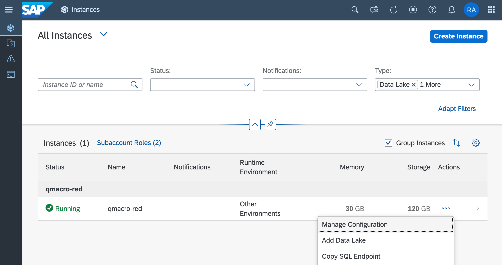
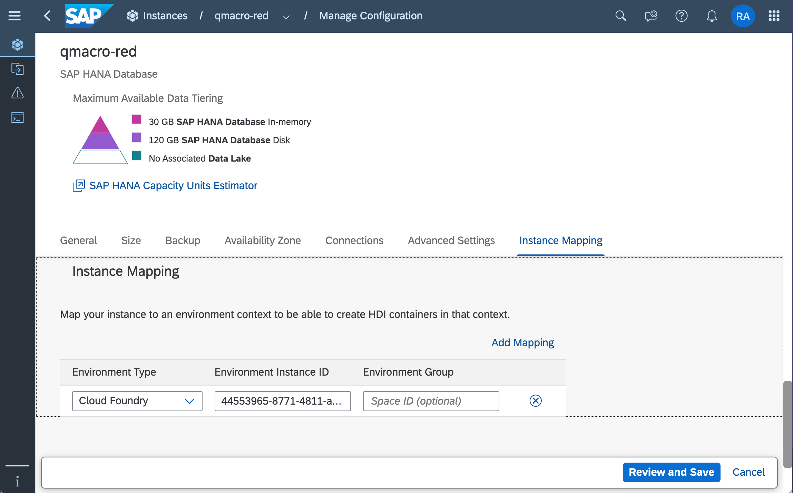
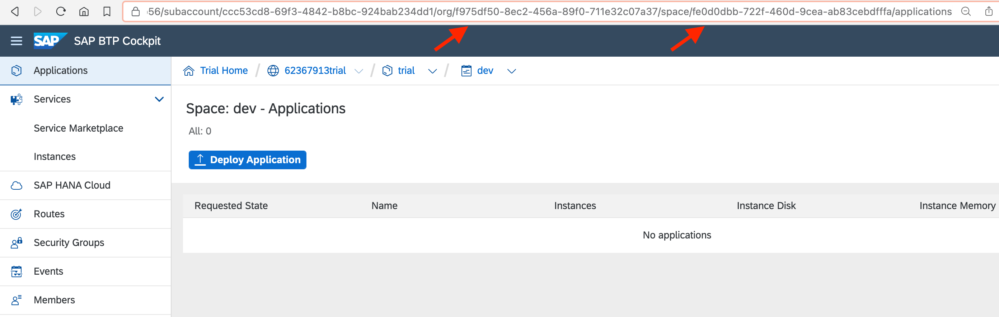
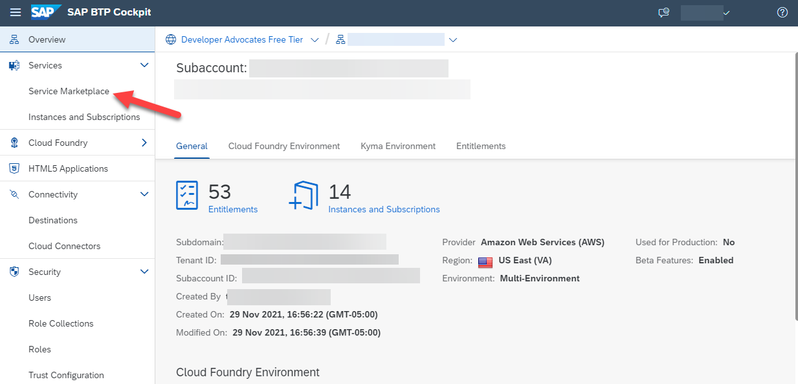
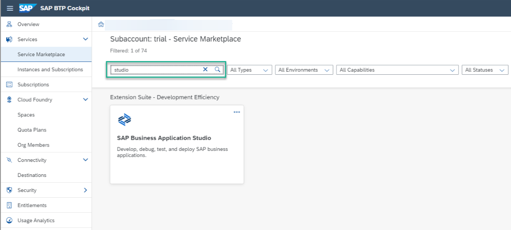
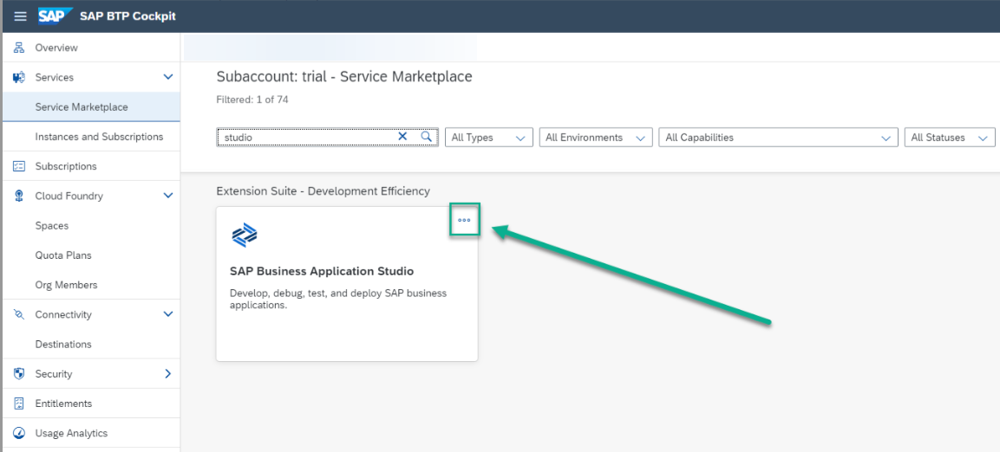
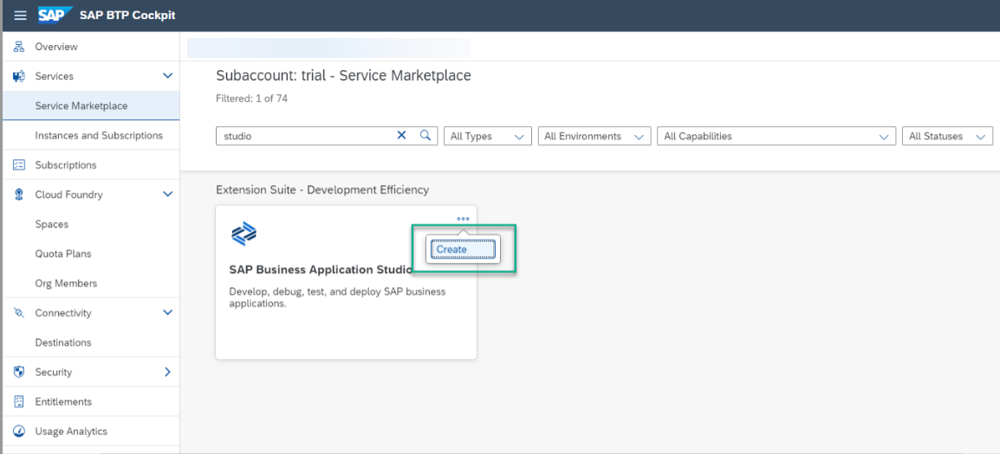
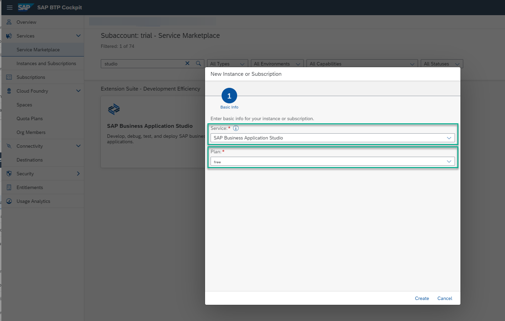

# Exercise 1 - Set Up SAP HANA Cloud and CAP Project

Before we can begin development we must perform a couple of important steps.

First, we need to provision an SAP HANA Cloud database instance. This will be in a "multi-environment" context with the SAP HANA Cloud Administration Tools (see the "Further Study" section below for a link to more information on this). We must then make that database instance available to the environment instance where we'll be managing deployments with HDI containers, which here will be in your Cloud Foundry environment instance.

Second, we must also ensure that we have access to our chosen development environment.

## Exercise 1.1 Deploy SAP HANA Cloud

We will use the SAP BTP cockpit as a graphical tool to provision your free SAP HANA Cloud instance if you don't already have one in your account.

First, perform all the steps in 👉 [tutorial: Deploy SAP HANA Cloud](https://developers.sap.com/tutorials/hana-cloud-deploying.html). This is a one time activity. You now have an SAP HANA database fully accessible to you with the full range of HANA Cloud capabilities.  

Once your database instance is up and running, use the same SAP HANA Cloud Central tool (to which you have a subscription) to map the details of your Cloud Foundry instance to the database instance, so that your development-focused working environment, where you'll be creating an instance of the service for using HDI containers, can access and utilize the SAP HANA Cloud database instance itself.

In the SAP HANA Cloud Central tool, identify the database instance you just created, and use the context menu to select "Manage Configuration":

In the SAP HANA Database Advanced Settings page, within the Instance Mapping section, use the "Add Mapping" button to add a new entry; the Environment Type is preset to "Cloud Foundry", and you must specify the following values for the Environment Instance ID and Environment Group:

* Environment Instance ID: The ID of the Cloud Foundry organization
* Environment Group: The ID of the Cloud Foundry space within the organization

Note that these IDs are GUIDs, and a quick way to get hold of both is to navigate in the SAP BTP Cockpit to the page for your Cloud Foundry space, and take the values from the URL when you get there. Here's an example:

Be sure to save your update to the configuration.

> **Very important** The system is stopped automatically each night and you need to manually restart every day you want to use it as described in the above tutorial. The most common error that people make is not restarting their HANA Cloud instance.

## Exercise 1.2 Set Up SAP Business Application Studio for Development

SAP Business Application Studio is a development environment available on SAP Business Technology Platform. Before you can start developing using SAP Business Application Studio, you must perform the required onboarding steps that are described in this step once. Please choose your path based upon if you are using the [SAP BTP free tier](https://developers.sap.com/tutorials/btp-free-tier-account.html) or [SAP BTP free trial](https://developers.sap.com/tutorials/hcp-create-trial-account.html).

SAP BTP free tier

1. If you are using the [SAP BTP free tier](https://developers.sap.com/tutorials/btp-free-tier-account.html), then complete the following steps

1. From you SAP BTP Global Account in the SAP BTP Cockpit, select the subaccount in which you want to enable the SAP Business Application Studio subscription.

1. From the navigation area, click Service Marketplace.
   

1. In the Service Marketplace page, search for `studio`.
   

1. Click Actions icon (three dots) to open the list of available actions.
   

1. Click Create to launch the wizard for subscribing to SAP Business Application Studio.
   

1. In the wizard verify that `SAP Business Application Studio` is selected in the Service field and `free` is selected in the Plan field.
   

1. Click `Create` to subscribe to SAP Business Application Studio.

SAP BTP free trial

1. If you are using the [SAP BTP free trial](https://developers.sap.com/tutorials/hcp-create-trial-account.html), then perform all the steps in [this tutorial - Set Up SAP Business Application Studio for Development](https://developers.sap.com/tutorials/appstudio-onboarding.html)

## Summary

Now that you have your SAP HANA Cloud database instance and have setup the basics of your development environment, we are ready to start our development project.

## Further Study

* [Tools to Manage and Access the SAP HANA Cloud, SAP HANA Database](https://developers.sap.com/tutorials/hana-cloud-mission-trial-3.html)
* [SAP HANA Cloud](https://community.sap.com/topics/hana)
* [SAP Business Application Studio](https://community.sap.com/topics/business-application-studio)
* [Subscribing to the SAP HANA Cloud Administration Tools](https://help.sap.com/docs/hana-cloud/sap-hana-cloud-administration-guide/subscribing-to-sap-hana-cloud-administration-tools)

## Next

Continue to 👉 [Exercise 2 - Create an SAP Cloud Application Programming Model Project for SAP HANA Cloud](../ex2/README.md)
