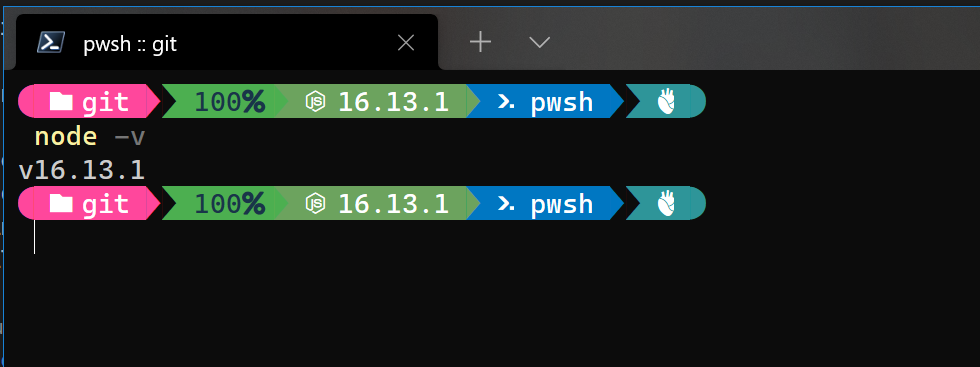
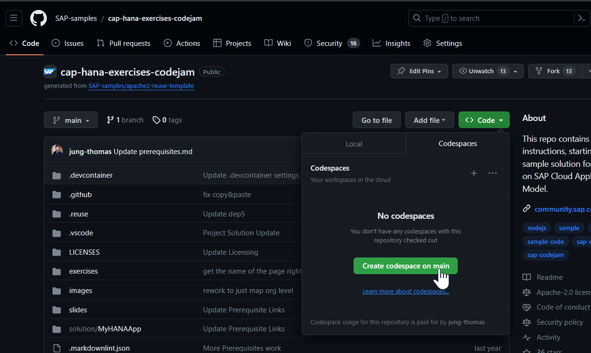

# Prerequisites

There are hardware, software and service prerequisites for participating in this CodeJam. The exercises will be shown executing in the [SAP Business Application Studio](https://community.sap.com/topics/business-application-studio) as the development tool. However you can also execute them [locally on your own tooling such as Microsoft VSCode](#prerequisites-for-performing-the-exercises-locally) or using a [Dev Container](#prerequisites-for-performing-the-exercises-in-a-dev-container) or [Codespace](#prerequisites-for-performing-the-exercises-in-a-codespaces). See separate section for each of these options.

## Normal Prerequisites (SAP Business Application Studio)

### Hardware

* If attending an in-person CodeJam, please bring your own laptop.

### Software

* [A web browser supported by the SAP Business Application Studio](https://help.sap.com/docs/SAP%20Business%20Application%20Studio/9d1db9835307451daa8c930fbd9ab264/8f46c6e6f86641cc900871c903761fd4.html#availability)

### Services

* Get a free SAP Business Technology Platform trial account (if you don't already have one):
  * [Tutorial: Get an SAP BTP Account for Tutorials](https://developers.sap.com/tutorials/btp-cockpit-setup.html)

## Prerequisites for Performing the Exercises Locally

In this exercise variant, you will install all development tools locally in your laptop and develop test there. Unfortunately the SAP HANA Graphical Calculation View Editor is not supported as a VSCode Extension yet, so those steps must be performed in the SAP Business Application Studio. However the rest of the exercises are possible locally.

There is also a brand new option that allows you to use VSCode locally but remotely connect it to your Business Application Studio dev space. This avoids the need to install all the prerequisites to local development. To read more about this option, [see here](https://blogs.sap.com/2023/05/09/product-updates-for-sap-business-application-studio-2304/?source=social-Global-YOUTUBE-MarketingCampaign-Developers-Business_Technology_Platform_Umbrella-spr-9927419192-account_name&campaigncode=CRM-XB23-MKT-DGEALL&sprinklrid=9927419192).

### Local Hardware

* None

### Local Software

* Ensure that you have [Node.js](https://nodejs.org/en/download/) verb [18](https://nodejs.org/dist/latest-v18.x/) or [20](https://nodejs.org/dist/latest-v20.x/) installed locally. In case of problems, see the [Troubleshooting guide for CAP](https://cap.cloud.sap/docs/get-started/troubleshooting#npm-installation).
  

* [Install Git](https://developers.sap.com/tutorials/btp-app-prepare-dev-environment-cap.html#21385226-8ed8-48c4-bc9e-97c38562ce93).

* [Install the Cloud Foundry command line interface](https://developers.sap.com/tutorials/btp-app-prepare-dev-environment-cap.html#f2d28e20-e4da-4eaf-9e55-7b9238b1f8bd)
  
* [Add CAP tooling](https://developers.sap.com/tutorials/btp-app-prepare-dev-environment-cap.html#79e1644f-4433-47dc-a770-5da00c9afce9)

* [Install Microsoft Visual Studio Code](https://developers.sap.com/tutorials/btp-app-prepare-dev-environment-cap.html#2dab2b4d-c9c7-40fa-a113-b6c0f02cddad)

* [Install VS Code extensions](https://developers.sap.com/tutorials/btp-app-prepare-dev-environment-cap.html#63037f80-b6bc-4b86-a8db-b0d9d23ea7d1)

* [Install SAP Fiori tools Extension Pack](https://developers.sap.com/tutorials/btp-app-prepare-dev-environment-cap.html#28ca825f-00b0-43ae-b34c-40f24facead8)

* [Install SAP Cloud MTA Build Tool](https://sap.github.io/cloud-mta-build-tool/download/)  

### Local Services

* See [Normal Prerequisites Services Section](#services)

## Prerequisites for Performing the Exercises in a Dev Container

In this scenario you will develop locally but we will reduce the amount of setup steps and tools you need to install by using [development containers](https://code.visualstudio.com/docs/remote/containers). This uses Docker Desktop and VSCode extensions provided by Microsoft to configure and remotely connect VSCode to this a container.

### Dev Container Hardware

* If running on arm64/Apple Silicon (otherwise known as the [Apple M1](https://en.wikipedia.org/wiki/Apple_M1)), the please change the [devcontainer.json](..devcontainer/devcontainer.json) file and the VARIANT value from `20-buster` to `20-bullseye` after cloning and starting the Dev Container

### Dev Container Software

* [Install Microsoft Visual Studio Code](https://developers.sap.com/tutorials/btp-app-prepare-dev-environment-cap.html#2dab2b4d-c9c7-40fa-a113-b6c0f02cddad)

* [Install Git](https://developers.sap.com/tutorials/btp-app-prepare-dev-environment-cap.html#21385226-8ed8-48c4-bc9e-97c38562ce93)

* [VS Code Extension for Remote Containers](https://marketplace.visualstudio.com/items?itemName=ms-vscode-remote.remote-containers)
  
* A Docker based container orchestration tool such as [Docker Desktop](https://www.docker.com/products/docker-desktop/) on Windows and MacOS or [Docker for Linux](https://docs.docker.com/engine/install/) on Linux
  > The license for Docker Desktop has changed - see [Docker is Updating and Extending Our Product Subscriptions](https://www.docker.com/blog/updating-product-subscriptions/) for an overview.
  
* [Clone this Repository](https://github.com/SAP-samples/cap-hana-exercises-codejam)
  

* When the project opens in VSCode you should receive a dialog in the lower right corner that the "Folder contains a Dev Container".  Choose to `Reopen in Container`
  

### Dev Container Services

* See [Normal Prerequisites Services Section](#services)

## Prerequisites for Performing the Exercises in a Codespaces

This is a bit of a hybrid scenario.  It uses the Dev Container configuration but runs the Dev Container and development tools in the cloud via [GitHub Codespaces](https://github.com/features/codespaces). It has the ease of starting similar to SAP Business Application Studio and its Dev Spaces, but allows for more customization of the environment and usage of a larger range of VSCode Extensions.

### Codespaces Hardware

* None

### Codespaces Software

* From GitHub choose the option to create a new codespace.
  
  
* You can then use this codespace from the browser or open it remotely in your locally VSCode installation. The codespace will be pre-configured with the correct Node.js runtime, all other development tools and already has the project cloned into it.

### Codespaces Services

* See [Normal Prerequisites Services Section](#services)
