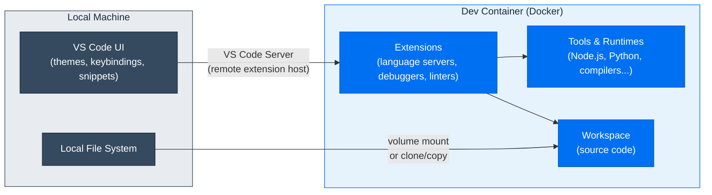

# Prerequisites

There are hardware, software and service prerequisites for participating in this CodeJam. The exercises will be shown executing in the [SAP Business Application Studio](https://community.sap.com/topics/business-application-studio) as the development tool. However you can also execute them [locally on your own tooling such as Microsoft VSCode](#prerequisites-for-performing-the-exercises-locally) or using a [Dev Container](#prerequisites-for-performing-the-exercises-in-a-dev-container) or [Codespace](#prerequisites-for-performing-the-exercises-in-a-codespaces). See separate section for each of these options.

> **Note on the HANA Graphical Calculation View Editor**: This tool is only available inside SAP Business Application Studio. If you choose a local development setup, you will need to return to BAS (or use a Dev Container / Codespace) specifically for Exercise 6. All other exercises can be completed locally.

## Normal Prerequisites (SAP Business Application Studio)

### Hardware

* If attending an in-person CodeJam, please bring your own laptop.

### Software

* [A web browser supported by the SAP Business Application Studio](https://help.sap.com/docs/SAP%20Business%20Application%20Studio/9d1db9835307451daa8c930fbd9ab264/8f46c6e6f86641cc900871c903761fd4.html#availability)

### Services

* You will get access to the provided SAP BTP account for the CodeJam. If you want to continue learning afterwards, you can also sign up for a free SAP Business Technology Platform trial account:
  * [Tutorial: Get an SAP BTP Account for Tutorials](https://developers.sap.com/tutorials/btp-cockpit-setup.html)

---

## Prerequisites for Performing the Exercises Locally

In this exercise variant, you will install all development tools locally and develop there. Unfortunately the SAP HANA Graphical Calculation View Editor is not supported as a VSCode Extension yet, so Exercise 6 must be performed in the SAP Business Application Studio. However the rest of the exercises are possible locally.

There are two additional approaches to get BAS-quality tooling without a full local install:

* **Remote Access for SAP Business Application Studio** — connects your local VS Code to a running BAS dev space in the cloud, so all tools and runtimes execute remotely. See the [section below](#remote-access-for-sap-business-application-studio).
* **SAP Business Application Studio toolkit** — installs BAS tooling (wizards, project explorer, task runners) directly into your local VS Code, no remote connection needed. See the [section below](#sap-business-application-studio-toolkit).

### Remote Access for SAP Business Application Studio

The [Remote Access for SAP Business Application Studio](https://marketplace.visualstudio.com/items?itemName=SAPOSS.app-studio-remote-access) extension (`SAPOSS.app-studio-remote-access`) allows you to connect to SAP Business Application Studio dev spaces directly from a local Visual Studio Code desktop application. Your code and all development tools run inside the remote BAS dev space; your local VS Code is just the UI.

* **Reduced Local Setup**: No need to install Node.js, CAP tooling, CF CLI, or SAP extensions locally — everything runs in the remote dev space.
* **Full BAS tooling parity**: Because the dev space is a real BAS environment, BAS-exclusive tools such as the HANA Graphical Calculation View editor (Exercise 6) are available.
* **Requires an active BAS dev space**: You need an SAP BTP account with BAS enabled and a running dev space to connect to.

For detailed information, refer to the [blog post](https://blogs.sap.com/2023/05/09/product-updates-for-sap-business-application-studio-2304/?source=social-Global-YOUTUBE-MarketingCampaign-Developers-Business_Technology_Platform_Umbrella-spr-9927419192-account_name&campaigncode=CRM-XB23-MKT-DGEALL&sprinklrid=9927419192).

### SAP Business Application Studio toolkit

The [SAP Business Application Studio toolkit](https://marketplace.visualstudio.com/items?itemName=SAPOSS.app-studio-toolkit) (`SAPOSS.app-studio-toolkit`) brings essential BAS capabilities directly into your **local** VS Code installation — no running BAS workspace or remote connection required.

It installs the same SAP-maintained tooling that powers BAS dev spaces, including:

* **Application Wizard** — the Yeoman-based project scaffolding UI used in BAS exercises (same wizard dialogs, locally)
* **SAP Project Explorer** — the dedicated sidebar panel for navigating CAP, Fiori, and MTA projects
* **Actions and task runners** — BAS-style run configurations surfaced in the VS Code UI

Install it from the VS Code Marketplace:

1. Open VS Code and go to the Extensions panel (`Ctrl+Shift+X` / `Cmd+Shift+X`).
2. Search for **SAP Business Application Studio toolkit** or paste `SAPOSS.app-studio-toolkit` into the search box.
3. Click **Install**.

> **vs. Remote Access above**: Remote Access *connects your local VS Code to a remote, running BAS dev space* — your code and tools actually run in the cloud. The toolkit extension is self-contained and runs entirely on your local machine, requiring no active BAS subscription or network connection to SAP BTP for day-to-day development. The tradeoff is that some BAS-exclusive graphical tools (such as the HANA Calculation View editor used in Exercise 6) are not available locally even with the toolkit extension.

### Local Hardware

* None

### Local Software

#### Node.js

Install Node.js **24** (recommended) or another even-numbered LTS release (20 or 22). Odd-numbered versions lack native module support for some CAP dependencies and may fail to install. In case of problems, see the [Troubleshooting guide for CAP](https://cap.cloud.sap/docs/get-started/troubleshooting#npm-installation).

| OS | Instructions |
| --- | --- |
| **Windows** | Download the installer from [nodejs.org](https://nodejs.org/en/download/) or use `winget install OpenJS.NodeJS.LTS` |
| **macOS** | Use [Homebrew](https://brew.sh/): `brew install node@24`, or download from [nodejs.org](https://nodejs.org/en/download/) |
| **Linux** | Use [NodeSource](https://github.com/nodesource/distributions) — run `curl -fsSL https://deb.nodesource.com/setup_24.x \| sudo -E bash - && sudo apt-get install -y nodejs` (Debian/Ubuntu), or `sudo dnf install nodejs` (Fedora/RHEL) |

> **Tip**: On any OS, [nvm](https://github.com/nvm-sh/nvm) (macOS/Linux) or [nvm-windows](https://github.com/coreybutler/nvm-windows) (Windows) make it easy to switch between Node.js versions.

After installing, verify:

```bash
node --version   # should print v24.x.x
npm --version
```


#### Git

| OS | Instructions |
| --- | --- |
| **Windows** | Download from [git-scm.com](https://git-scm.com/download/win) or `winget install Git.Git` |
| **macOS** | Included with Xcode Command Line Tools: `xcode-select --install`, or `brew install git` |
| **Linux** | `sudo apt-get install git` (Debian/Ubuntu) or `sudo dnf install git` (Fedora/RHEL) |

#### Cloud Foundry CLI

| OS | Instructions |
| --- | --- |
| **Windows** | Download the installer from [Cloud Foundry CLI releases](https://docs.cloudfoundry.org/cf-cli/install-go-cli.html) or `winget install CloudFoundry.cli` |
| **macOS** | `brew install cloudfoundry/tap/cf-cli@8` |
| **Linux** | Follow the [CF CLI Linux install guide](https://docs.cloudfoundry.org/cf-cli/install-go-cli.html#pkg-linux) |

Verify: `cf --version`

#### CAP Development Kit (`@sap/cds-dk`)

Install globally via npm — same command on all platforms:

```bash
npm install -g @sap/cds-dk
cds --version
```

See [Add CAP tooling](https://developers.sap.com/tutorials/cp-apm-nodejs-create-service.html#f1f8e95a-3c77-462b-80fc-0579d49e4afe) for the full walkthrough.

#### MTA Build Tool

```bash
npm install -g mbt
mbt --version
```

Alternatively download a binary from the [SAP Cloud MTA Build Tool releases page](https://sap.github.io/cloud-mta-build-tool/download/).

### Local IDE Options

The exercises and screenshots use **Microsoft Visual Studio Code**, but other editors work for the non-BAS steps.

#### Microsoft Visual Studio Code (recommended for local development)

1. [Install VS Code](https://code.visualstudio.com/) — available for Windows, macOS, and Linux.
2. Install the required extensions:
   * [SAP CDS Language Support](https://marketplace.visualstudio.com/items?itemName=SAPSE.vscode-cds)
   * [SAP Fiori Tools Extension Pack](https://marketplace.visualstudio.com/items?itemName=SAPSE.sap-ux-fiori-tools-extension-pack)
   * [ESLint](https://marketplace.visualstudio.com/items?itemName=dbaeumer.vscode-eslint)
   * [SAP HANA Database Explorer](https://marketplace.visualstudio.com/items?itemName=SAPSE.hana-database-explorer) *(optional – for SQL-level exploration)*
   * [REST Client](https://marketplace.visualstudio.com/items?itemName=humao.rest-client) *(optional – for testing OData endpoints)*
   * [Remote Access for SAP Business Application Studio](https://marketplace.visualstudio.com/items?itemName=SAPOSS.app-studio-remote-access) *(optional – connect your local VS Code to a running BAS dev space; see [section above](#remote-access-for-sap-business-application-studio))*
   * [SAP Business Application Studio toolkit](https://marketplace.visualstudio.com/items?itemName=SAPOSS.app-studio-toolkit) *(optional – run BAS wizards and tooling locally without a remote connection; see [section above](#sap-business-application-studio-toolkit))*

   > Install one of the two extensions above depending on your preference — **Remote Access** if you want to work inside a cloud-hosted BAS dev space, or the **toolkit** if you want BAS-style tooling running entirely on your local machine. See the sections linked above for a full comparison.

See also the full list in [Install VS Code extensions](https://developers.sap.com/tutorials/cp-apm-nodejs-create-service.html#77505c79-8374-4afb-99a6-9530fb52f968).

#### JetBrains IDEs (WebStorm / IntelliJ IDEA Ultimate)

JetBrains IDEs can be used for editing JavaScript, CDS, and YAML files. Note the following limitations:

* There is no official SAP CDS Language Server plugin for JetBrains. CDS files (`.cds`) will be treated as plain text — you lose syntax highlighting and code completion for CDS.
* SAP Fiori tools visual editors are VS Code / BAS only.
* The MTA build, `cds` CLI, and CF CLI all work from the JetBrains integrated terminal as normal.

If you use a JetBrains IDE, plan to switch to BAS or VS Code for Exercise 6 (Calculation View) and wherever CDS editing guidance is shown in the exercises.

#### Neovim / other editors

Any editor that supports the [CDS Language Server Protocol](https://www.npmjs.com/package/@sap/cds-lsp) can provide CDS IntelliSense. Install the language server globally:

```bash
npm install -g @sap/cds-lsp
```

Then configure your editor's LSP client to use `cds-lsp --stdio` as the language server for `.cds` files.

### Local Services

* See [Normal Prerequisites Services Section](#services)

---

## Prerequisites for Performing the Exercises in a Dev Container

In this scenario you will develop locally but reduce the amount of setup steps and tools you need to install by using [development containers](https://code.visualstudio.com/docs/remote/containers). This uses Docker Desktop and VSCode extensions provided by Microsoft to configure and remotely connect VSCode to a container.

### Devcontainer Architecture


```mermaid
graph LR
    subgraph local["Local Machine"]
        UI["VS Code UI<br/>(themes, keybindings, snippets)"]
        FS["Local File System"]
    end

    subgraph container["Dev Container (Docker)"]
        EXT["Extensions<br/>(language servers, debuggers, linters)"]
        TOOLS["Tools & Runtimes<br/>(Node.js, Python, compilers...)"]
        WS["Workspace<br/>(source code)"]
    end

    UI -- "VS Code Server<br/>(remote extension host)" --> EXT
    FS -- "volume mount<br/>or clone/copy" --> WS
    EXT --> TOOLS
    EXT --> WS

    classDef localNode fill:#354A5E,stroke:#1B2A3B,color:#FFFFFF
    classDef containerNode fill:#0070F2,stroke:#0057C2,color:#FFFFFF
    class UI,FS localNode
    class EXT,TOOLS,WS containerNode
    style local fill:#E8ECF0,stroke:#354A5E,color:#1B2A3B
    style container fill:#E6F3FC,stroke:#0070F2,color:#1B2A3B
```

All Node.js, npm, Git, CF CLI, CAP tooling, and VS Code extensions are pre-configured inside the container image — you do not need to install them on your host machine.

### Dev Container Software

* [Install Microsoft Visual Studio Code](https://code.visualstudio.com/)

* [Install Git](https://git-scm.com/book/en/v2/Getting-Started-Installing-Git).

* [VS Code Extension for Remote Containers](https://marketplace.visualstudio.com/items?itemName=ms-vscode-remote.remote-containers)

* A Docker-based container orchestration tool:

  | OS | Recommended option |
  | --- | --- |
  | **Windows** | [Docker Desktop](https://www.docker.com/products/docker-desktop/) (requires WSL 2 backend; enable in Docker Desktop settings) |
  | **macOS** | [Docker Desktop](https://www.docker.com/products/docker-desktop/) or [OrbStack](https://orbstack.dev/) (lighter alternative) |
  | **Linux** | [Docker Engine](https://docs.docker.com/engine/install/) — no Desktop required. Add your user to the `docker` group: `sudo usermod -aG docker $USER` then log out and back in |

  > The license for Docker Desktop has changed — see [Docker is Updating and Extending Our Product Subscriptions](https://www.docker.com/blog/updating-product-subscriptions/) for an overview. For corporate laptops, check with your IT policy or consider [Podman Desktop](https://podman-desktop.io/) as a licence-free alternative.

* [Clone this Repository](https://github.com/SAP-samples/cap-hana-exercises-codejam)
  

* When the project opens in VSCode you should receive a dialog in the lower right corner that the "Folder contains a Dev Container". Choose to `Reopen in Container`
  

### Node.js Docker Images for Dev Containers

When using Dev Containers, you might encounter different Node.js Docker images such as `buster`, `bullseye`, and `bookworm`. These names refer to different Debian releases that the Node.js images are based on:

* **buster**: Based on Debian 10. Older, stable release.
* **bullseye**: Based on Debian 11. Good balance of stability and up-to-date packages.
* **bookworm**: Based on Debian 12. Current stable release — the default in this repository's `devcontainer.json`.

For most users `bookworm` (the current default) is the right choice.

### Dev Container Services

* See [Normal Prerequisites Services Section](#services)

---

## Prerequisites for Performing the Exercises in a Codespaces

This is a hybrid scenario. It uses the Dev Container configuration but runs the container and development tools in the cloud via [GitHub Codespaces](https://github.com/features/codespaces). It has the ease of getting started similar to SAP Business Application Studio Dev Spaces, but allows for more customization of the environment and a larger range of VS Code Extensions.

### Codespaces Hardware

* None — everything runs in the cloud.

### Codespaces Software

* From GitHub choose the option to create a new codespace.
  

* You can then use this codespace from the browser or open it remotely in your locally installed VS Code. The codespace will be pre-configured with the correct Node.js runtime, all other development tools, and will already have the project cloned into it.

> **Note**: GitHub Codespaces has a free monthly quota for personal accounts. If you exceed it, charges apply. Check your [Codespaces billing settings](https://github.com/settings/billing) before extended use.

### Codespaces Services

* See [Normal Prerequisites Services Section](#services)

---

## AI Code Assistant Setup

SAP has moved towards open tooling in the AI code assistant space. Rather than a single prescribed tool, you can choose from several options that integrate well with the SAP CAP and HANA ecosystem. The options below all work in VS Code (local or Dev Container) and in GitHub Codespaces.

> AI code assistants can help with boilerplate CAP service definitions, CDS annotations, JavaScript handlers, and understanding OData/HANA patterns. They work best as a complement to the SAP documentation — always verify generated code against the CAP docs at [cap.cloud.sap](https://cap.cloud.sap/docs/).

### GitHub Copilot

[GitHub Copilot](https://github.com/features/copilot) is a widely used AI code assistant within VS Code and GitHub Codespaces. It provides inline completions and a chat interface.

1. Subscribe to [GitHub Copilot](https://github.com/features/copilot) (free tier available for individual users).
2. Install the [GitHub Copilot extension](https://marketplace.visualstudio.com/items?itemName=GitHub.copilot) in VS Code.
3. Install the [GitHub Copilot Chat extension](https://marketplace.visualstudio.com/items?itemName=GitHub.copilot-chat) for the chat panel.
4. Sign in with your GitHub account when prompted.

This repository includes Copilot workspace instructions in `.github/copilot-instructions.md` and scoped instructions in `.github/instructions/` that guide Copilot on CAP conventions and safe editing patterns for this project — they are picked up automatically when you use Copilot Chat inside the repo.

### SAP Joule / SAP Build Code AI

If you are developing inside SAP Business Application Studio, [SAP Joule](https://www.sap.com/products/technology-platform/joule.html) is the native AI assistant integrated into BAS. It is aware of CAP, CDS, and the SAP ecosystem out of the box.

* Joule is available in SAP BAS dev spaces — no additional installation required.
* It supports CDS generation, OData service scaffolding, and HANA artifact guidance.
* SAP Build Code (a BAS-based product) bundles Joule with a full CAP-aware IDE experience.

See [SAP Build Code documentation](https://help.sap.com/docs/build_code) for setup details.

### Claude Code (Anthropic)

[Claude Code](https://claude.ai/code) is a terminal-based AI coding assistant that works on macOS, Linux, and Windows (WSL). It is capable in reasoning tasks and understanding multi-file CAP projects.

```bash
npm install -g @anthropic-ai/claude-code
claude
```

Claude Code reads `CLAUDE.md` files in the repository to understand project conventions — this repository includes a `CLAUDE.md` at the root. Requires an [Anthropic API key or Claude.ai Pro/Team subscription](https://www.anthropic.com/claude).

### Continue (open-source, bring your own model)

[Continue](https://continue.dev/) is an open-source VS Code extension that works with many model providers (OpenAI, Anthropic, local models via Ollama, etc.). It is a good option if you prefer open tooling or want to run a local model.

1. Install the [Continue extension](https://marketplace.visualstudio.com/items?itemName=Continue.continue) in VS Code.
2. Configure a model provider in the Continue settings panel (`~/.continue/config.json`).
3. For a fully offline setup, install [Ollama](https://ollama.com/) and pull a code model such as `ollama pull qwen2.5-coder:14b`.

### SAP MCP Servers

[Model Context Protocol (MCP)](https://modelcontextprotocol.io/) is an open standard that lets AI assistants call tools provided by external servers — giving the AI structured, authoritative access to documentation, project models, and scaffolding actions rather than relying on training data alone. SAP publishes official MCP servers for its core development areas. All four servers below run via `npx` (no global install required) and work with any MCP-compatible client including GitHub Copilot Agent mode, Claude Code, Cline, and Continue.

> These servers are especially valuable for this CodeJam — they give your AI assistant live access to CAP and Fiori documentation and can scaffold artifacts directly into your project.

#### @cap-js/mcp-server — CAP (CDS) MCP server

[`@cap-js/mcp-server`](https://www.npmjs.com/package/@cap-js/mcp-server) is the official MCP server for AI-assisted development of SAP Cloud Application Programming Model (CAP) applications. It provides the AI with:

* **`search_model`** — fuzzy search across your compiled CDS model (entities, fields, services, HTTP endpoints) so the AI can understand your project's data model without reading raw `.cds` files.
* **`search_docs`** — local vector-embedding search through the full CAP documentation, enabling the AI to find relevant guidance even with inexact search terms.

Configure it in your MCP client using `npx`:

```json
{
  "mcpServers": {
    "cds-mcp": {
      "command": "npx",
      "args": ["-y", "@cap-js/mcp-server"]
    }
  }
}
```

For Claude Code specifically: `claude mcp add --transport stdio --scope user cds-mcp -- npx -y @cap-js/mcp-server`

#### @sap-ux/fiori-mcp-server — SAP Fiori MCP server

[`@sap-ux/fiori-mcp-server`](https://www.npmjs.com/package/@sap-ux/fiori-mcp-server) is the official MCP server for SAP Fiori application development. It enables AI agents to create and modify SAP Fiori elements and freestyle applications through structured tool calls. Key capabilities:

* Scaffold a new SAP Fiori elements app inside a CAP project from a natural-language prompt.
* Add, modify, or delete pages, controller extensions, and `manifest.json` properties.
* Search SAP Fiori elements, annotations, UI5, and SAP Fiori tools documentation.

SAP recommends using this server together with `@cap-js/mcp-server` and `@ui5/mcp-server` for full-stack Fiori + CAP development.

```json
{
  "mcpServers": {
    "fiori-mcp": {
      "type": "stdio",
      "timeout": 600,
      "command": "npx",
      "args": ["--yes", "@sap-ux/fiori-mcp-server@latest", "fiori-mcp"]
    }
  }
}
```

#### @ui5/mcp-server — SAPUI5 / OpenUI5 MCP server

[`@ui5/mcp-server`](https://www.npmjs.com/package/@ui5/mcp-server) is the official MCP server for SAPUI5 and OpenUI5 development. It improves the AI developer experience by providing:

* **`create_ui5_app`** / **`create_integration_card`** — scaffold new UI5 apps or UI Integration Cards from templates.
* **`get_api_reference`** — fetch and format live UI5 API documentation.
* **`get_guidelines`** — provide UI5 coding best practices to the AI.
* **`run_ui5_linter`** — integrate with `@ui5/linter` to detect and report UI5-specific issues.
* **`run_manifest_validation`** — validate `manifest.json` against the UI5 schema.

```json
{
  "mcpServers": {
    "@ui5/mcp-server": {
      "type": "stdio",
      "command": "npx",
      "args": ["-y", "@ui5/mcp-server"]
    }
  }
}
```

For Claude Code: `claude mcp add --transport stdio --scope user ui5-mcp-server -- npx -y @ui5/mcp-server`

> **Windows note**: On native Windows (not WSL) you may need to prefix `npx` with `cmd /c` in the `command` field.

#### @sap/mdk-mcp-server — SAP Mobile Development Kit MCP server

[`@sap/mdk-mcp-server`](https://www.npmjs.com/package/@sap/mdk-mcp-server) is the official MCP server for AI-assisted development of [SAP Mobile Development Kit (MDK)](https://help.sap.com/docs/mobile-development-kit) applications. MDK allows you to build cross-platform mobile and web apps that run on SAP Mobile Services. This MCP server gives AI agents the context and tools needed to create and modify MDK metadata projects.

```json
{
  "mcpServers": {
    "mdk-mcp": {
      "command": "npx",
      "args": ["-y", "@sap/mdk-mcp-server"]
    }
  }
}
```

> MDK development is not covered in this CodeJam, but if you are extending your skills to mobile after completing these exercises, the MDK MCP server is the recommended starting point for AI-assisted MDK work.

---

### General tips for using AI assistants with this project

* Point your assistant at `solution/MyHANAApp` — ask it to read `db/interactions.cds` and `srv/interaction_srv.cds` before asking CAP-specific questions.
* For HANA-specific topics (HDI, calculation views, stored procedures) the assistants benefit from context — paste the relevant `.hdbprocedure` or `.hdbcalculationview` content into the chat.
* Do not ask an AI assistant to modify `mta.yaml`, `xs-security.json`, or `app/router/xs-app.json` independently — these files must stay aligned with each other (see the [Copilot guardrail instructions](.github/instructions/deployment-config-safety.instructions.md)).
