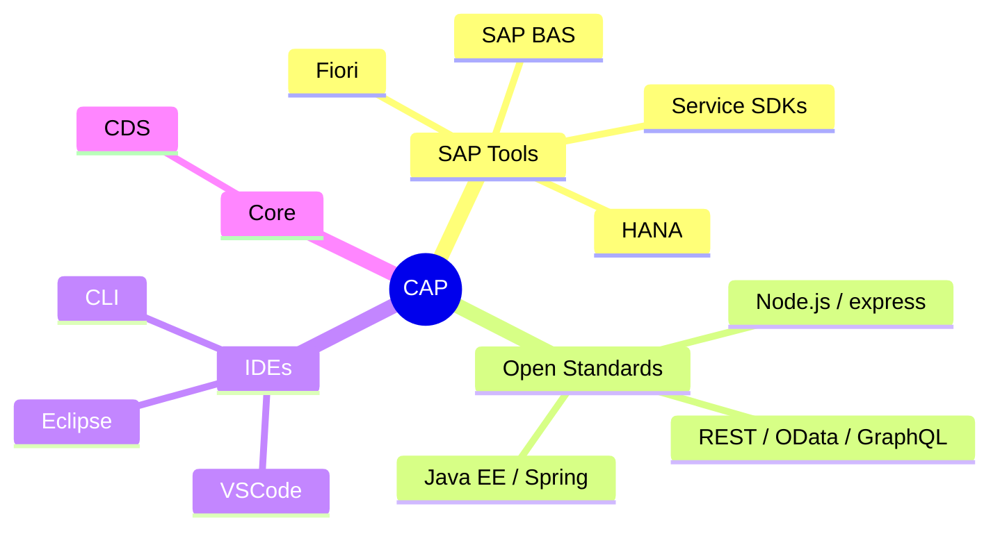
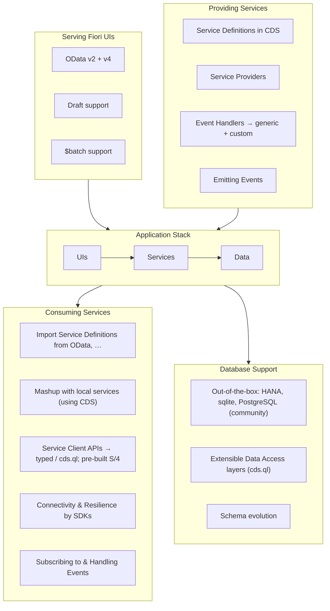
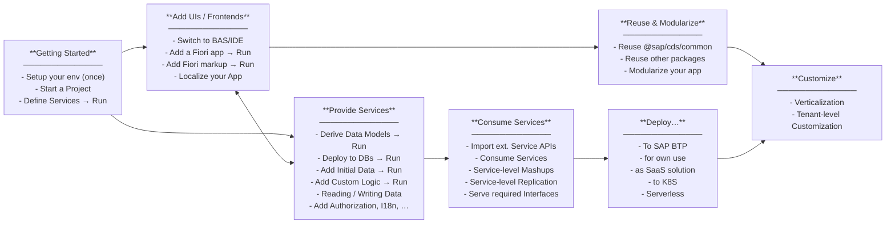
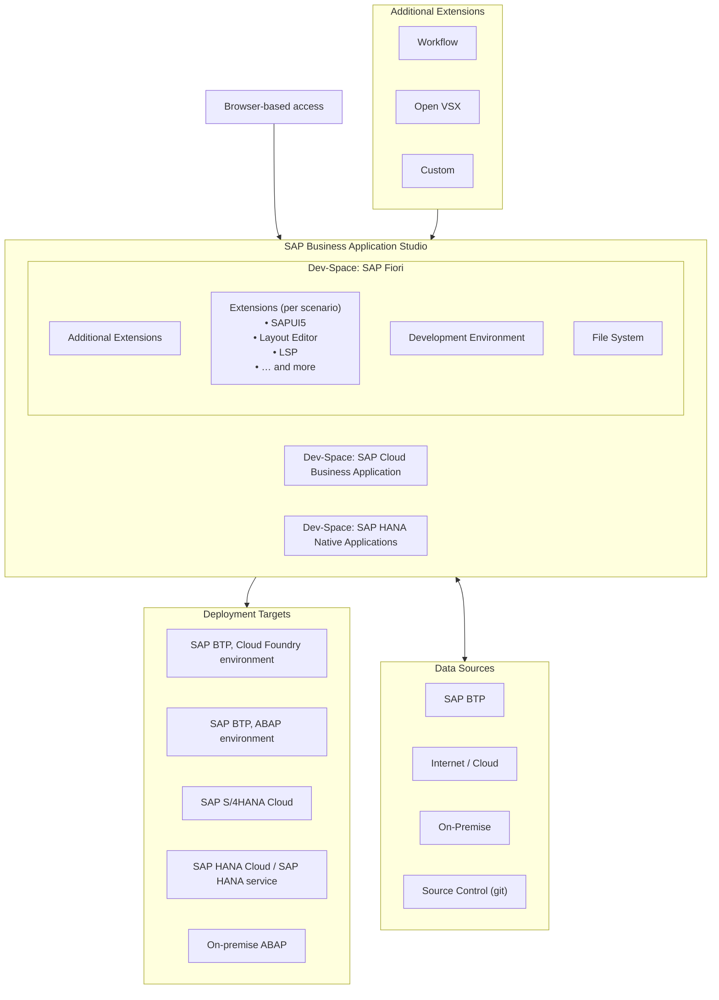

# SAP CodeJam 2024
## Combine SAP Cloud Application Programming Model with SAP HANA Cloud to Create Full-Stack Applications

*The Developer Advocates present*

---

## Agenda

- Introduction to SAP Cloud Application Programming Model
- Introduction to SAP Business Application Studio / Build Code
- [Exercise 1 - Set Up SAP HANA Cloud and Development Environment](../exercises/ex1/README.md)
- [Exercise 2 - Create an SAP Cloud Application Programming Model Project for SAP HANA Cloud](../exercises/ex2/README.md)
- [Exercise 3 - Create Database Artifacts Using Core Data Services for SAP HANA Cloud](../exercises/ex3/README.md)
- [Exercise 4 - Create a User Interface with CAP](../exercises/ex4/README.md)
- [Exercise 5 - Add User Authentication to Your Application](../exercises/ex5/README.md)
- [Exercise 6 - Create Calculation View and Expose via CAP](../exercises/ex6/README.md)
- [Exercise 7 - Create HANA Stored Procedure and Expose as CAP Service Function](../exercises/ex7/README.md)
- Wrap-Up

---

## Introduction to SAP Cloud Application Programming Model

### What Is CAP?

The SAP Cloud Application Programming Model is an **opinionated**, yet **open** framework of tools, languages and libraries to efficiently build enterprise-grade services and applications.

It guides developers along a 'golden path' of proven **best practices**, while minimizing boilerplate so they can **focus on their domain** problems at hand.

The framework features a mix of broadly adopted **open-source** and **SAP** tools and technologies.



---

### SAP Cloud Application Programming Model – One Level Deeper

We complement *cloud-native technologies* with…

- a **CDS-based Services** framework…
- w/ intrinsic **enterprise** & **cloud** qualities

w/ *1st-class support* by and for…

- **SAP Business Application Studio** ┐
- **SAP Fiori**                        │ *without lock-in!*
- **SAP HANA**                         │
- **S/4 Extension** scenarios, …      ┘

→ **Guidance** and **best practices** leveraging proven SAP technologies **+** Open Source software

→ A *consistent* end-to-end **programming model** for *enterprise* services & applications

```mermaid
block-beta
  columns 3
  block:ide["web based IDE + local"]:1
    BAS["SAP BAS"]
    Eclipse["Eclipse / VSCode / CLI"]
  end
  block:cap["SAP Cloud Appl. Prog. Model"]:1
    UI["SAP Fiori + other"]
    SDK["Service SDKs"]
    DB["SAP HANA + other"]
    CDS["CDS"]
  end
  block:platform["Platform Services"]:1
    S4["SAP S/4HANA"]
    SF["SAP SuccessFactors"]
    Concur["SAP Concur"]
    Hybris["SAP Hybris"]
    Fieldglass["SAP Fieldglass"]
  end
  block:infra["Infrastructure"]:3
  end
```

---

### Context and CAP's Focus

CAP focuses on the **Develop / Run / Test** lifecycle for your services and applications, while platform services (CI/CD, Operate) and infrastructure concerns are handled by surrounding tools and the SAP Cloud SDK.

```mermaid
flowchart LR
    subgraph Platform["Platform Ecosystem"]
        FE["Frontends / UIs"]
        Scale["Scaling"]
        Profile["Profiling"]
        Monitor["Monitoring"]
        Identity["Identities"]
        Auth["Authentication"]
        API["API Management"]
        Dest["Destinations"]
        Conn["Connectivity"]
        Cache["Caching"]
        BigData["Big Data"]
        HANA["SAP HANA"]
        DB["Databases"]
        CICD1["CI/CD"]
        Prov["Provisioning"]
    end

    subgraph YourApp["Your Services and Apps"]
        SVC["Services"]
        DATA["Data"]
        CON["Consumers"]
    end

    subgraph Lifecycle["Development Lifecycle"]
        Setup["Setup"]
        Dev["Develop"]
        Run["Run"]
        Test["Test"]
        CICD2["CI/CD"]
        Operate["Operate"]
    end

    YourApp --> Lifecycle
    Platform --> YourApp
```



---

### CAP Focus Areas Breakdown



---

### CAP: Key Value Propositions

- ✅ **Guidance and Best Practices** → opinionated *and* staying open and flexible
- ✅ **Intrinsic Enterprise & Cloud Qualities** → taken care of out-of-the-box
- ✅ **Integration and Interoperability** → easily reuse models and services
- ✅ **Accelerated Development** → grow as you go & time to market
- ✅ **Focus on your Domain** → what, not how; minimized boilerplate
- ✅ **Minimized Footprint** → enabling serverless deployments
- ✅ **Safeguarded Investments** → e.g. on journeys to new platform picks

---

### Cookbook — Walking Through Your Tasks



---

### CAP: A Layered Model

```mermaid
block-beta
  columns 4

  block:fiori["SAP Fiori"]:1
  end
  block:bas["SAP Business Application Studio IDE"]:1
  end
  block:cli["CLI, VSCode, Eclipse, …"]:1
  end
  block:cicd["CI / CD"]:1
  end

  block:cap["**SAP Cloud Appl. Prog. Model**"]:1
  end

  block:sdk["SAP Service SDKs, Events, FaaS"]:1
  end

  block:cloud["Cloud-Native Technologies"]:2
  end

  block:infra["SAP BTP, SAP HANA, …"]:4
  end
```

---

## Introduction to SAP Business Application Studio / Build Code

### SAP Business Application Studio on BTP

**General Availability on Azure, AWS, Google, and Ali-Cloud**

A modern development environment, tailored for efficient development of business applications for SAP enterprise scenarios.

---

### SAP Business Application Studio / Build Code — Value Proposition

| | Description |
|---|---|
| **Turn-key Solution** | Instantly spin-up pre-packaged environments with tools and runtimes, tailored for developing SAP business applications |
| **Simplified Development** | Enjoy a seamless end-to-end development environment with a desktop-like experience in the cloud — available anywhere, anytime |
| **Integrate SAP Solutions** | Build smarter, more intelligent applications integrating SAP services, technologies, and solutions to cater for your business needs |
| **Ultimate Productivity** | Accelerate app development using wizards, optimized code & graphical editors, local test run & debug, terminal (CLI) access, quick deployment, and more |

> SAP Business Application Studio is built on Open Source and leading industry standards.

---

### SAP Business Application Studio — The Big Picture



---

### Visual Studio Code vs SAP Business Application Studio

| | **SAP Business Application Studio / Build Code** | **Visual Studio Code** |
|---|---|---|
| **Environment** | Managed, hosted cloud environment on SAP BTP | Local desktop install; developer-controlled |
| **Offline** | Requires internet connection | Fully offline capable |
| **SAP tooling** | Pre-packaged dev spaces with SAP tools and runtimes built in; centrally configured and shareable | SAP tools available via extensions; each developer installs and maintains their own setup |
| **Administration** | Centrally administrated — IT can manage tool repositories, system access, and company policies | Individually managed per developer machine |
| **Extensions** | VS Code-compatible extensions via Open VSX marketplace | Thousands of extensions from the VS Code marketplace |
| **Open Source & standards** | Based on open source and leading industry standards; fast-evolving SAP-integrated tooling | MIT-licensed open source; broad community ecosystem |

---

### Visual Studio Code and SAP Business Application Studio — Side by Side

**Visual Studio Code**

- Provides development flexibility with **offline** capabilities
- Features a **developer-controlled**, highly configurable development environment
- Allows access to thousands of extensions from the Visual Studio Code marketplace
- Is part of a fast growing open source community

**SAP Business Application Studio / Build Code**

- Provides a **managed**, preconfigured, **hosted environment**, optimized for SAP application development
- Can be **centrally administrated** with tools repositories, systems access and company policies
- Integrates with existing SAP solutions, systems & services
- Easy access to Visual Studio Code-compatible extensions from open source Theia marketplace

---

## Hands-on Exercises

Exercise instructions: [https://github.com/SAP-samples/cap-hana-exercises-codejam](https://github.com/SAP-samples/cap-hana-exercises-codejam)

---

## Where to Find More Information

| Resource | URL |
|---|---|
| Exercise Instructions | [https://github.com/SAP-samples/cap-hana-exercises-codejam](https://github.com/SAP-samples/cap-hana-exercises-codejam) |
| HANA Topic Page | [https://pages.community.sap.com/topics/hana](https://pages.community.sap.com/topics/hana) |
| Business Application Studio Topic Page | [https://pages.community.sap.com/topics/business-application-studio](https://pages.community.sap.com/topics/business-application-studio) |
| SAP Cloud Application Programming Model Topic Page | [https://pages.community.sap.com/topics/cloud-application-programming](https://pages.community.sap.com/topics/cloud-application-programming) |
| SAP Cloud Application Programming Model Documentation | [https://cap.cloud.sap/docs/](https://cap.cloud.sap/docs/) |

---

## Key Points to Take Home

- The value of the dev space in the SAP Business Application Studio
- How to use SAP Cloud Application Programming Model (CAP) Core Data Services (CDS) to create simple database entities
- How to define database-agnostic artifacts in the persistence module
- How to create an SAP Fiori freestyle web interface
- How to configure the AppRouter
- How to create an instance of the User Authentication and Authorization service
- How to configure Cloud Application Programming (CAP) service authentication

---

*© 2026 SAP SE or an SAP affiliate company. All rights reserved.*
*Contact: Thomas Jung — thomas.jung@sap.com*
