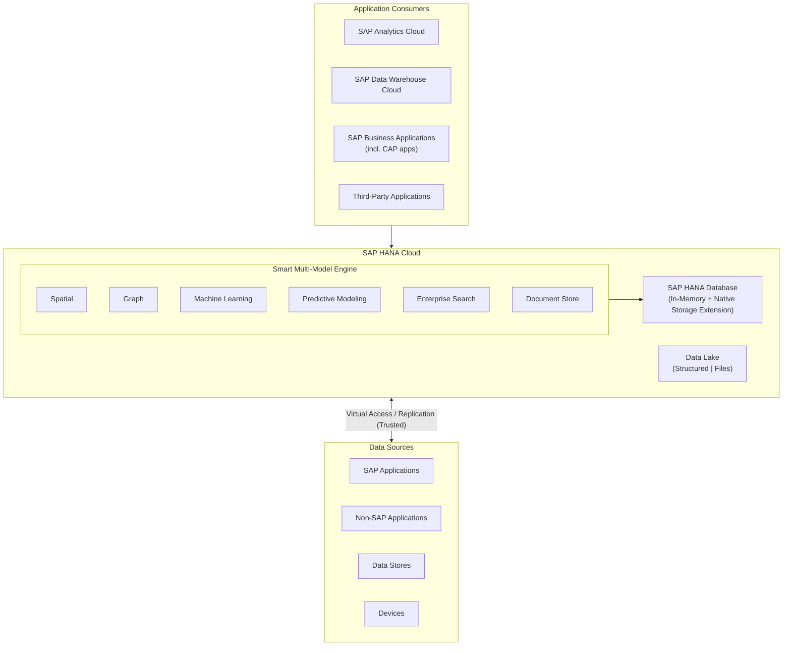
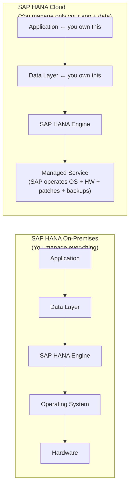
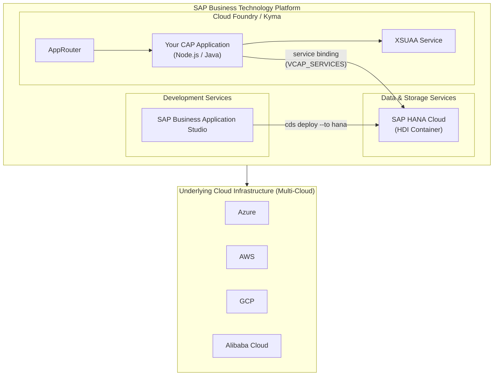
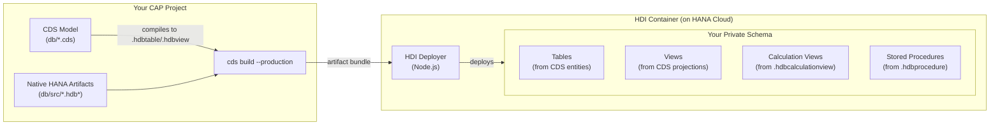
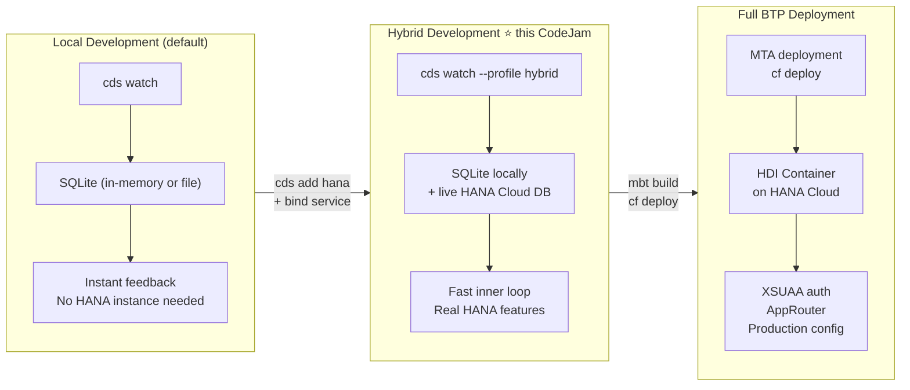
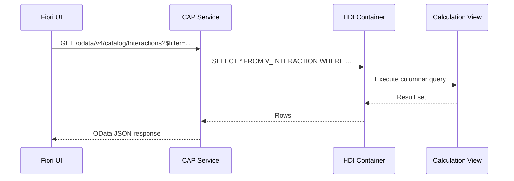
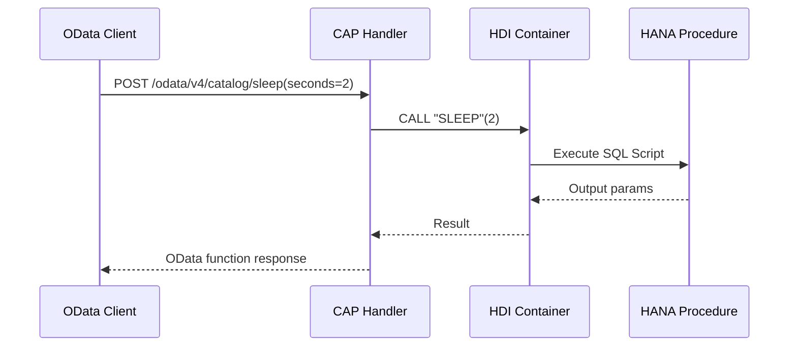
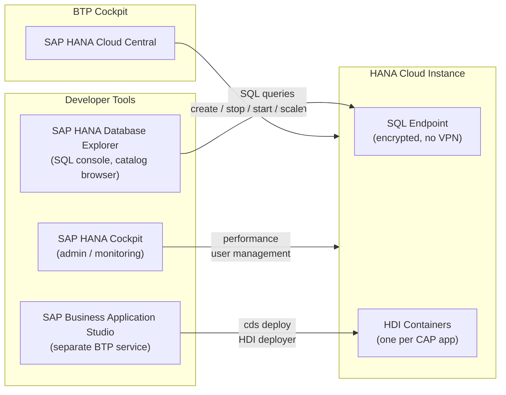

# SAP HANA Cloud — Introduction for CAP Developers

---

## What Is SAP HANA Cloud?

SAP HANA Cloud is a **managed, cloud-native, multi-model database** service on SAP Business Technology Platform. It combines the full power of the SAP HANA in-memory database engine with cloud qualities — elastic scale, automatic patching, high availability, and low operational overhead — so your team focuses on building applications rather than running infrastructure.

### Architecture Overview



### Two Core Services

| Service | What It Is | When CAP Uses It |
|---|---|---|
| **SAP HANA Cloud, SAP HANA database** | Powerful **in-memory** database combining OLTP + OLAP, with multi-model engine for relational and document data | Primary persistence target for CAP applications |
| **SAP HANA Cloud, data lake** | High-performance analytics platform for large-volume, on-demand analytics | Advanced analytics scenarios; accessed via virtual tables from the HANA database |

---

## Why SAP HANA Cloud for CAP Applications?

From a **CAP developer's perspective**, the key reasons to target HANA Cloud specifically are:

### 1. CAP's First-Class HANA Support

CAP treats SAP HANA as its **primary production database**. Out of the box you get:

- Automatic CDS-to-HANA schema deployment via HDI
- Full OData query pushdown — complex `$filter`, `$expand`, and aggregations execute as native SQL on HANA
- `cds.ql` query language that compiles efficiently to HANA SQL
- Native support for HANA calculation views and stored procedures alongside your CDS model

### 2. In-Memory Performance for Enterprise Workloads

HANA combines **OLTP and OLAP in a single engine**. This means your CAP service can handle transactional writes and analytical reads against the same dataset without maintaining separate stores or ETL pipelines. For CAP apps serving Fiori UIs with complex aggregations, this is significant.

### 3. Managed Service = No Infrastructure Work

With SAP HANA Cloud, you do not manage the OS, patches, or hardware. Compared to on-premises HANA:



As a CAP developer you only own:
- Your CDS data model and service definitions
- Your custom event handlers
- Your HDI artifacts (calculation views, procedures)

Everything below is operated by SAP.

---

## SAP HANA Cloud and SAP BTP — Where CAP Lives

CAP applications deployed to BTP run in Cloud Foundry (or Kyma/K8S). SAP HANA Cloud is a **Data & Storage Service** within BTP — it sits in the same platform, bound to your CAP app via a service binding that CAP consumes automatically.



**Key point for CAP:** you never configure a JDBC/ODBC connection string manually. CAP reads the bound service credentials at runtime and opens the connection automatically.

---

## How CAP Connects to SAP HANA Cloud — The HDI Model

This is the most important concept for a CAP developer. CAP does **not** connect directly to the HANA database as `DBADMIN`. Instead it uses **HDI — HANA Deployment Infrastructure**.

### What Is HDI?

HDI is a container-based deployment model built into HANA. Each CAP application gets its own isolated **HDI container** — a private schema where all your database objects live. The HDI container owner deploys objects using declarative artifact files; HDI tracks dependencies and applies changes incrementally.



### What `cds build --production` Produces

When you run `cds build --production` (or `cds deploy --to hana`), CDS compiles your `.cds` files into HANA-native HDI artifact files:

| CDS construct | Generated HDI artifact |
|---|---|
| `entity` | `.hdbtable` |
| `view` / projection | `.hdbview` |
| `association` → FK | `.hdbconstraint` |
| `@cds.persistence.calcview` entity | no generated file — maps to your existing `.hdbcalculationview` |
| Stored procedure call | maps to your `.hdbprocedure` via CAP handler |

---

## Local Development vs. HANA Cloud Deployment

CAP's dev loop gives you three modes. Understanding all three prevents a lot of confusion:



### Hybrid Development — The Best of Both Worlds

**Hybrid mode** is what this CodeJam uses. You run `cds watch` locally but bind it to a real HANA Cloud HDI container, so:

- Your Node.js server restarts instantly on file changes (no cloud redeploy)
- Your data lives in a real HANA Cloud instance — Calculation Views, stored procedures, and HANA-specific SQL all work
- No SAP BTP deployment pipeline, no XSUAA wiring — just a service binding

```bash
# One-time setup: deploy the schema to your HDI container
cds deploy --to hana

# Day-to-day: start the local server connected to HANA Cloud
cds watch --profile hybrid
```

The `hybrid` profile in `package.json` tells CAP to use HANA as the database while still running the server locally:

```json
{
  "cds": {
    "requires": {
      "db": {
        "[development]": { "kind": "sqlite" },
        "[hybrid]":      { "kind": "hana" },
        "[production]":  { "kind": "hana" }
      }
    }
  }
}
```

The service binding (from `cf create-service-key` or BTP cockpit) is picked up via `cds bind` or a local `.cdsrc-private.json`, so no credentials are hard-coded.

### Adding HANA Support to a CAP Project

```bash
# Add HANA dependencies and configuration
cds add hana

# Deploy schema to HDI container (requires bound HANA Cloud service)
cds deploy --to hana

# Or build the MTA for full BTP deployment
cds build --production
mbt build
cf deploy mta_archives/*.mtar
```

The same CDS model runs on SQLite locally, on HANA Cloud in hybrid mode, and in production — no code changes required for standard entities and queries.

---

## HANA-Native Features Accessible from CAP

Once your app targets HANA Cloud, you gain access to capabilities that go beyond what SQLite can simulate. These are the features exercises 6 and 7 of this CodeJam explore.

### Calculation Views

A **Calculation View** is a HANA-native graphical/scripted analytical model. It lives in `db/src/` as a `.hdbcalculationview` file and is authored in SAP Business Application Studio's graphical editor. Calculation views can join, aggregate, and filter data with HANA's columnar engine — the ideal tool for read-heavy analytical projections.

**How CAP exposes a Calculation View:**

```cds
// db/interactions.cds
using { app.interactions } from './interactions';

// Tells CAP: don't generate a table — map this entity to an existing HANA object
@cds.persistence.calcview
entity V_INTERACTION {
    key INTERACTION_ID  : String(36);
        TITLE           : String(100);
        ITEM_COUNT      : Integer;
        -- ... other projected columns
}
```

```cds
// srv/interaction_srv.cds
service CatalogService {
    // Expose the calc view entity as a read-only OData entity set
    @readonly entity Interactions as projection on V_INTERACTION;
}
```

CAP generates an OData entity set backed by the HANA calculation view. All `$filter` and `$orderby` expressions are pushed down to HANA as SQL — no data leaves HANA until it reaches the response payload.



### Stored Procedures

A **Stored Procedure** encapsulates database-side business logic in SQL Script. It lives in `db/src/` as a `.hdbprocedure` file. CAP exposes stored procedures as **service functions** — callable via OData actions/functions — by wiring them in a JavaScript handler.

```cds
// srv/interaction_srv.cds
service CatalogService {
    // Declare a CAP function that will call a HANA stored procedure
    function sleep(seconds: Integer) returns String;
}
```

```js
// srv/interaction_srv.js
module.exports = cds.service.impl(async function () {
    const db = await cds.connect.to('db');

    this.on('sleep', async (req) => {
        const { seconds } = req.data;
        // Execute the HANA stored procedure via CAP's db connection
        await db.run(`CALL "SLEEP"(${seconds})`);
        return `Slept for ${seconds} second(s)`;
    });
});
```



### When to Use Native HANA Artifacts vs. Pure CDS

| Need | Use |
|---|---|
| Standard CRUD entities, simple projections | Pure CDS — works on SQLite and HANA |
| Complex multi-join analytics with aggregation | Calculation View (`.hdbcalculationview`) |
| Business logic that must run inside the database | Stored Procedure (`.hdbprocedure`) |
| Full-text search, spatial queries, graph traversal | HANA multi-model features via native SQL in handlers |
| Schema migration / versioning | CDS schema evolution (`cds deploy`) — HDI applies diffs |

> **Rule of thumb:** write as much as possible in pure CDS. Drop to native HANA artifacts only when you need HANA-specific computation that CDS cannot express or that must run inside the database engine for performance reasons.

---

## SAP HANA Cloud Value Proposition (Summary)

| Pillar | What It Means |
|---|---|
| **Multi-Service DB** | In-memory engine combining OLTP + OLAP, multi-model (relational, document, graph, spatial, ML) in one service |
| **Power of the Cloud** | Low TCO, elastic scale, high availability, autonomous operations, serverless principles |
| **Data On-Demand** | All data available regardless of size, category, or complexity |
| **Streamlined Access** | Unified access layer — no requirement to consolidate all data into one storage tier |
| **Easy Integration** | Harmonized data integration to intelligent applications via virtual access and replication |
| **Developer Experience** | HDI container model, native tooling in BAS, graphical calculation view editor, SQL console |

---

## Managing Your SAP HANA Cloud Instance

Instances are provisioned and managed through the **SAP HANA Cloud Central** tool, accessible from the BTP Cockpit.



**Connection security:** HANA Cloud uses an encrypted SQL connection with TLS. No VPN is required. Access is controlled by IP allowlisting and standard HANA authentication. The minimum required HANA client version is 2.4.155.

**For CAP:** the connection details (host, port, credentials) are injected automatically as a bound service via `VCAP_SERVICES` in Cloud Foundry, or as a Kubernetes secret in Kyma. You never hardcode connection strings.

### Free Trial

SAP HANA Cloud is available on a **free trial** — a production-grade instance with a memory cap, suitable for development and learning. This is what you provision in Exercise 1 of this CodeJam.

> Free trial instances automatically stop after 24 hours of inactivity. Restart them from SAP HANA Cloud Central before beginning an exercise session.

---

## Datacenter Locations

SAP HANA Cloud instances run on **AWS, Azure, Google Cloud, and Alibaba Cloud** across regions in North America, South America, Europe, and Asia Pacific. Customers choose a region at provisioning time; the closest available region is the default. Co-locating your CAP application and HANA Cloud instance in the same region minimises latency.

---

## Where to Find More Information

| Resource | URL |
|---|---|
| SAP HANA Cloud Documentation | [https://help.sap.com/docs/hana-cloud](https://help.sap.com/docs/hana-cloud) |
| HANA Community Topic Page | [https://pages.community.sap.com/topics/hana](https://pages.community.sap.com/topics/hana) |
| CAP + HANA Documentation | [https://cap.cloud.sap/docs/guides/databases-hana](https://cap.cloud.sap/docs/guides/databases-hana) |
| SAP HANA Cloud Free Tier | [https://www.sap.com/hanacloud](https://www.sap.com/hanacloud) |
| SAP HANA Cloud Roadmap | [https://roadmaps.sap.com](https://roadmaps.sap.com) |
| SAP Community Blogs | [https://community.sap.com](https://community.sap.com) |
| CodeJam Exercise Repository | [https://github.com/SAP-samples/cap-hana-exercises-codejam](https://github.com/SAP-samples/cap-hana-exercises-codejam) |

---

*© 2026 SAP SE or an SAP affiliate company. All rights reserved.*
*Contact: Thomas Jung — <thomas.jung@sap.com>*
